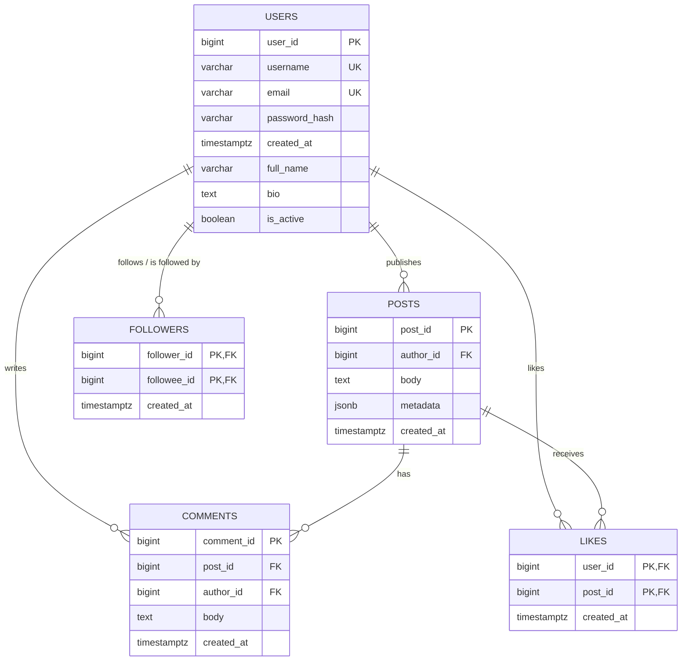

# Social Media Lab

A small social-media backend used to practice relational schema design,
transactions, caching, and query tuning: users can register, post, follow
each other, comment, and like posts, with a Redis-cached, per-follower
timeline backed by Postgres and an activity log written to MongoDB.

## Architecture

Clean-architecture layering, each layer depending only on the one below it:

```text
models, interfaces   dataclasses + Protocols — no I/O, no driver imports
  ↑
repositories          Postgres access (one table or query each), no business logic
  ↑
services              one transaction + side effects (activity log, cache) per use case
  ↑
app + cli             composition root — wires real Postgres/Redis/Mongo, dispatches commands
```

Services never touch `psycopg2`/`redis`/`pymongo` directly — they depend on
the `Protocol`s in `src/social/interfaces/` (`UnitOfWork`, `Cache`,
`ActivityLogger`, one per repository), and the `App` class in
`src/social/app.py` is the only place that wires the real
Postgres/Redis/Mongo-backed implementations to them. Unit tests substitute
fakes for those same protocols instead.

## Schema

Five tables, normalized to 3NF: no derived/cached columns (e.g. no stored
`like_count`), no repeating groups, and every non-key attribute depends on
nothing but its table's whole key. This is the same DDL
`src/social/database/schema.py` creates automatically the first time the app
connects (see [Setup](#setup)):



**Legend:** `PK` primary key · `FK` foreign key · `UK` unique constraint ·
`PK,FK` a column that is both at once — `followers` and `likes` are pure
associative tables whose composite primary key is built entirely from their
two foreign keys, which also doubles as the index that prevents a duplicate
edge.

Each table's primary key is named after the table it belongs to
(`user_id`, `post_id`, `comment_id`) so it reads the same way here as it
does everywhere it's referenced as a foreign key (`author_id`, `post_id`,
`follower_id`/`followee_id`, ...). The generated schema itself
(`src/social/database/schema.py`) still names these columns plain `id` —
the standard surrogate-key convention — so when reading the DDL directly,
mentally substitute `users.id` for this diagram's `user_id`, and likewise
for `posts`/`comments`.

A foreign key is named for the *role* it plays, not just the table it
targets — several columns below look different but all point at the exact
same primary key:

| This column | ...is a foreign key to |
| ------------ | ------------------------ |
| `posts.author_id`, `comments.author_id` | `users.user_id` |
| `followers.follower_id`, `followers.followee_id` | `users.user_id` (both — see below) |
| `likes.user_id` | `users.user_id` |
| `comments.post_id`, `likes.post_id` | `posts.post_id` |

`followers` is *why* role-based names matter rather than being pure
inconsistency: it needs two separate references to `users.user_id` in the
same row (who's following, who's being followed), so both can't be called
`user_id` — there'd be no way to tell them apart, and no way to even
declare two columns with the same name in one table. `likes` only ever
references a user in one role ("who liked this"), so `user_id` is
unambiguous there without needing a more specific name.

### Why `USERS`↔`COMMENTS` exists alongside `USERS`↔`POSTS`↔`COMMENTS`

`COMMENTS` sits between two tables (`USERS` and `POSTS`) that are *also*
connected to each other, which draws as a triangle. That's not a redundant
relationship stated twice — `comments` carries two independent foreign
keys, and neither one can be derived from the other:

- `author_id` says **who wrote** the comment.
- `post_id` says **which post** it's on.

Nothing ties those together: any user can comment on any post, so the
comment's author is never implied by the post's author. If it were —
if comments could only ever be left by the post's own author — then
`USERS`↔`COMMENTS` really would be redundant and should be dropped in
favor of going through `POSTS`. It isn't, so both edges stay, each with its
own verb (`writes` vs. `has`) so they're never mistaken for the same fact.
`LIKES` forms the identical shape for the identical reason: `user_id` (who
liked it) and `post_id` (what they liked) are two independent columns on
one row, not a chain through `posts.author_id`.

`ON DELETE CASCADE` on every foreign key is what makes both edges "real":
deleting a user removes their comments (via `author_id`) *and* their posts
(via `author_id` on `posts`, cascading again to that post's comments via
`post_id`) — two separate cascade paths, matching the two separate edges.

### One self-referencing edge, not two

`FOLLOWERS` is drawn as a single self-referencing edge on `USERS`, not two:
`follower_id` and `followee_id` are both `users.id`, so "follows" and "is
followed by" are the same edge viewed from either end — drawing it a second
time would just repeat that one relationship under a different label.
`chk_followers_no_self_follow` (enforced in the schema, invisible to a
diagram) blocks a user from following themselves.

**This is a many-to-many relationship** — any user can follow many users,
and be followed by many users — modeled the only correct relational way:
via `followers` as an associative/junction table between `users` and
itself, rather than, say, an array column on `users`. The `||--o{` edge in
the diagram above is the standard way an ERD draws *half* of a many-to-many
relationship (`USERS` to the junction table); since both sides of this
particular M:N are the same `USERS` table, one edge captures the whole
relationship instead of two. The composite primary key
`(follower_id, followee_id)` is what actually enforces the "many-to-many,
no duplicate edge" semantics: either column alone repeats freely (a user
can appear in many rows as a follower and in many rows as a followee), but
the *pair* must be unique.

### Normalization (3NF)

A relation is in 3NF when every non-key attribute depends on the whole key,
nothing but the key, and no non-key attribute depends on another non-key
attribute. All five tables qualify:

- **users** — `username`, `email`, `password_hash`, `created_at`,
  `full_name`, `bio`, `is_active` each describe the user identified by `id`
  directly, and none of them determines another.
- **posts** — `author_id`, `body`, `metadata`, `created_at` depend only on
  `id`. `metadata` (JSONB) holds free-form, per-post attributes (tags,
  location) — a deliberate denormalization for schema flexibility, not a
  3NF violation, since nothing in it determines or is determined by `body`
  or `author_id`.
- **comments** — `body` and `created_at` depend only on `id`; `post_id` and
  `author_id` are foreign keys, not derived attributes.
- **followers** / **likes** — pure associative tables whose only non-key
  attribute, `created_at`, depends on the *whole* composite key
  (`(follower_id, followee_id)` / `(user_id, post_id)`) — the moment that
  specific edge was created — never on either column alone.

No table stores a value derivable from other columns (e.g. no cached
`like_count` on `posts`), so all five satisfy 1NF, 2NF, and 3NF together.

### ACID guarantees

An ERD can only show half of ACID directly — the constraints baked into the
schema. The other half is how the app opens and closes a transaction around
them. Both halves matter, so here's where each property actually comes from:

| Property | How it's guaranteed |
| -------- | -------------------- |
| **Atomicity** | Every service call opens one `PostgresUnitOfWork` (`src/social/database/unit_of_work.py`) — one connection, one cursor, one transaction. `__exit__` rolls back automatically if the block raised, and rows only become visible to anyone else after an explicit `uow.commit()`. A use case's writes either all land or none do. |
| **Consistency** | Enforced *declaratively* in `src/social/database/schema.py`, not just in application code: `NOT NULL` and `UNIQUE` on `users.username`/`email`, `FOREIGN KEY ... ON DELETE CASCADE` on every reference (so a comment/post/like/follow can never outlive the row it points to), and `CONSTRAINT chk_followers_no_self_follow CHECK (follower_id <> followee_id)`. A transaction that would violate any of these is rejected by Postgres itself and rolled back — the database can't reach an invalid state no matter what the app does. |
| **Isolation** | Each service call gets its *own* connection from the pool via `uow_factory()` (never one connection shared across calls), running at Postgres's default `READ COMMITTED` level, so no transaction ever sees another's uncommitted writes. The composite primary keys on `followers` (`follower_id, followee_id`) and `likes` (`user_id, post_id`) also mean two concurrent "follow the same person twice" or "like the same post twice" transactions can't both succeed — the loser gets a unique-violation instead of silently double-inserting. |
| **Durability** | Once `uow.commit()` returns, Postgres's write-ahead log (WAL) is what makes that write survive a crash — this is Postgres's own guarantee, not something this app implements. The app's only responsibility is to call `commit()` explicitly and only once a transaction is known-good (see Atomicity above), rather than relying on autocommit to paper over a partially-applied change. |

### Indexing & query performance

- `idx_posts_author_id`, `idx_comments_post_id`, `idx_comments_author_id` —
  support the FK lookups implied by cascading deletes and basic joins.
- `followers_pkey` (composite B-tree on `follower_id, followee_id`) —
  doubles as the uniqueness constraint on a follow edge and as the access
  path the feed timeline query uses: given a `follower_id`, find every
  `followee_id`. It also already covers `PostgresFollowerRepository.
  list_following` (`WHERE follower_id = %s`), since `follower_id` leads it.
- `idx_posts_author_created_at` (`author_id, created_at DESC`) — lets the
  feed timeline query fetch each followed author's posts pre-sorted,
  avoiding a full sort after the join.
- `idx_likes_post_id` — supports the trending-posts aggregation, which
  groups likes by `post_id` over a recent time window.
- `idx_posts_created_at` (`created_at DESC, id DESC`) — supports
  `PostgresPostRepository.list_recent`'s global, un-filtered
  `ORDER BY created_at DESC, id DESC LIMIT %s`. Every other posts index is
  led by `author_id`, so without this one that query had nothing to use but
  a full scan + sort.
- `idx_comments_post_created_at` (`post_id, created_at`) — supports
  `PostgresCommentRepository.list_by_post`'s `WHERE post_id = %s
  ORDER BY created_at ASC`; `idx_comments_post_id` alone finds the rows but
  still needs a separate sort step.
- `idx_followers_followee_id` (`followee_id, created_at DESC`) — supports
  `PostgresFollowerRepository.list_followers` (`WHERE followee_id = %s
  ORDER BY created_at DESC`), the reverse direction of `followers_pkey`.
  This was a genuine gap: nothing indexed `followee_id` at all, so asking
  "who follows this user" was a full table scan.

**`EXPLAIN ANALYZE`, feed timeline query:** seeded 500 users, ~30 follow
edges/user (15,000 rows), 50 posts/user (25,000 rows), then ran
`EXPLAIN (ANALYZE, BUFFERS)` on `queries/feed_timeline.sql` for one follower
(30 followees, ~1,500 candidate posts, `LIMIT 20`) before and after adding
`followers_pkey` / `idx_posts_author_created_at`:

```text
Before (no followers_pkey, no idx_posts_author_created_at):
Limit  (actual time=5.993..5.999 rows=20 loops=1)
  ->  Sort  (actual time=5.992..5.995 rows=20 loops=1)
        ->  Hash Join  (actual time=1.088..5.356 rows=1500 loops=1)
              ->  Seq Scan on posts p  (rows=25000 loops=1)
              ->  Hash
                    ->  Seq Scan on followers f  (rows=30 loops=1)
                          Filter: (follower_id = 1)
                          Rows Removed by Filter: 14970
Execution Time: 6.034 ms

After:
Limit  (actual time=3.533..3.537 rows=20 loops=1)
  ->  Sort  (actual time=3.531..3.534 rows=20 loops=1)
        ->  Hash Join  (actual time=0.195..3.119 rows=1500 loops=1)
              ->  Seq Scan on posts p  (rows=25000 loops=1)
              ->  Hash
                    ->  Bitmap Heap Scan on followers f  (rows=30 loops=1)
                          ->  Bitmap Index Scan on followers_pkey
                                Index Cond: (follower_id = 1)
Execution Time: 3.571 ms
```

`followers_pkey` turned "scan all 15,000 follow edges, throw away 14,970"
into a direct index lookup for this follower's ~30 followees — the dominant
win (6.03ms → 3.57ms, ~40% less time). `idx_posts_author_created_at` is
**not** used here: at this selectivity (30 of 500 authors, ~1,500 of 25,000
posts), one sequential scan + hash join + top-N heapsort beats 30 separate
per-author index probes. That index earns its keep at higher post-table
scale, or on the single-author query it also serves —
`SELECT ... FROM posts WHERE author_id = %s ORDER BY created_at DESC` —
via index-only ordering with no sort step, regardless of table size.

**`EXPLAIN ANALYZE`, the three newer indexes:** re-ran at 10x scale (5,006
users, 250,307 posts, 149,724 follow edges — `queries/bulk_seed.sql`) to
check the three gaps identified above. Two of the three access patterns had
*no* supporting index at all before this pass, not just a suboptimal one:

```text
list_recent (global feed) — WHERE-less ORDER BY created_at DESC, id DESC LIMIT 20:

Before (no idx_posts_created_at):
Limit  (actual time=36.412..40.206 rows=20 loops=1)
  ->  Gather Merge  (actual time=36.410..40.200 rows=20 loops=1)
        ->  Sort  (actual time=28.762..28.766 rows=17 loops=2)
              Sort Method: top-N heapsort  Memory: 29kB
              ->  Parallel Seq Scan on posts  (rows=125154 loops=2)
Execution Time: 40.858 ms

After:
Limit  (actual time=0.060..0.080 rows=20 loops=1)
  ->  Index Scan using idx_posts_created_at on posts  (actual time=0.060..0.077 rows=20 loops=1)
Execution Time: 0.098 ms

list_followers — WHERE followee_id = 688 ORDER BY created_at DESC:

Before (no index on followee_id at all):
Sort  (actual time=5.731..5.734 rows=51 loops=1)
  ->  Seq Scan on followers  (actual time=0.044..5.706 rows=51 loops=1)
        Filter: (followee_id = 688)
        Rows Removed by Filter: 149673
Execution Time: 5.765 ms

After:
Sort  (actual time=0.109..0.112 rows=51 loops=1)
  ->  Bitmap Heap Scan on followers  (actual time=0.037..0.086 rows=51 loops=1)
        ->  Bitmap Index Scan on idx_followers_followee_id
              Index Cond: (followee_id = 688)
Execution Time: 0.134 ms
```

`idx_posts_created_at` is the largest win of the three (~417x, 40.9ms →
0.10ms): without it, the global feed had no filter to narrow on at all, so
every call sorted the entire 250k-row table (parallelized, but still a full
scan). `idx_followers_followee_id` fixed the genuine blind spot noted
above — going from "scan 149,724 rows to find 51" to a direct index lookup
(~43x, 5.77ms → 0.13ms).

`idx_comments_post_created_at`, by contrast, is **not** yet chosen by the
planner at this data's actual scale: each post here has only 2–3 comments
(seeded uniformly), so `idx_comments_post_id` already narrows to a handful
of rows and the leftover sort is negligible either way — the same "index
exists for an access pattern, not yet the cheapest plan at this
distribution" situation as `idx_posts_author_created_at` above. It earns
its keep once some posts accumulate hundreds/thousands of comments (a
viral-post shape this uniform seed doesn't model) rather than a handful
each.

## Project layout

```text
queries/          standalone SQL for the queries analyzed above (Indexing & query performance)
                  bulk_seed.sql — 5,000+ user/post/follow/like/comment loader for EXPLAIN ANALYZE at scale
scripts/          seed_data.py — optional demo-data loader
src/social/
  models/         one dataclass per file: User, Post, Comment, Follower, Like
  interfaces/     Protocols: repositories, Cache, ActivityLogger, UnitOfWork
  repositories/   one Postgres repository per table + the feed join query
  services/       one service per use case (transaction + activity log + cache)
  utils/          password_hashing.py, cache_keys.py — small, dependency-free helpers
  cache/          RedisCache (implements the Cache protocol)
  database/       Postgres pool/UnitOfWork, MongoActivityLogger, schema.py
  exceptions/     application-specific exception hierarchy
  app.py          App — the composition root, wires infra to services
  cli/            __main__.py (argparse + main()), interactive.py (REPL)
tests/
  unit/           fakes-based, no infrastructure required
main.py           `python main.py ...` without installing the package
```

## Setup

Postgres, Redis, and Mongo just need to be *reachable* somewhere — this
project doesn't care whether that's Docker, a locally installed service, or
anything else, and there's no migration step: `App.__init__`
(`src/social/app.py`) creates every table and index it needs itself, the
first time it connects. `docker-compose.yml` is provided purely as a
convenience for getting all three running locally in one command; using it
is optional.

```bash
docker compose up -d              # optional convenience: Postgres, Redis, Mongo in containers
python -m venv .venv
.venv/Scripts/activate             # .venv/bin/activate on macOS/Linux
pip install -e .
```

Copy `.env.example` to `.env` and point it at whatever Postgres/Redis/Mongo
you're actually running — it's loaded automatically, no manual `export`
needed. `POSTGRES_HOST`, `POSTGRES_PORT`, `POSTGRES_DB`, `POSTGRES_USER`,
and `POSTGRES_PASSWORD` are read individually and assembled into a
connection string by `config/settings.py`. If you do use
`docker-compose.yml`, note it maps Postgres/Redis/Mongo to host ports
5433/6380/27018 rather than their usual 5432/6379/27017 — this sidesteps a
common conflict where a locally installed Postgres, Redis-compatible (e.g.
Memurai), or Mongo service is already bound to the standard port and
silently intercepts the container's traffic on `localhost`. Either way,
whatever `.env` resolves to is exactly where the data goes — the app
doesn't check, or care, whether that's a container or a native install.

Once a store is reachable, `python main.py` (below) will create its own
schema on first connect. To load some demo data as well (4 users, follows,
posts, likes, comments — safe to re-run):

```bash
python scripts/seed_data.py
```

## Running

`python main.py` with no arguments launches an interactive menu — no flags
to remember. It first asks you to log in (by email and password) or
register; every action after that runs as that logged-in user, so it never
asks for your own id. Anything else it needs (who to follow, which post to
like or comment on) is shown as a numbered list to pick from, not typed in
as a raw id:

```text
$ python main.py
Social Media Lab - interactive mode. Ctrl-D or 'q' to quit.

1) login
2) register
q) quit

> 2
username: alice
email: alice@example.com
password:

Logged in as 'alice' (id=1).

1) create a post
2) follow a user
3) like a post
4) comment on a post
5) view my timeline
q) quit

> 2
Users you can follow:
  1) bob
pick a user (1-1): 1
```

Or drive it non-interactively, either via `python main.py <command> ...`
(no install needed) or the installed `social-cli` console script:

```bash
social-cli register alice alice@example.com hunter2
social-cli register bob bob@example.com hunter2
social-cli follow 1 2
social-cli post 2 "hello, world"
social-cli comment 1 1 "nice post"
social-cli like 1 1
social-cli timeline 1
```

## Tests

```bash
pytest tests/unit          # fakes only, no infrastructure required
```
