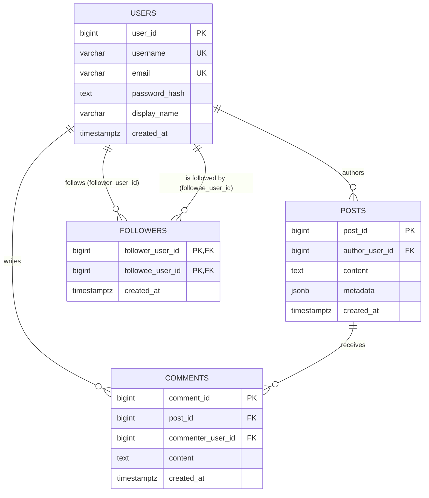

# Social Media Platform Data Backend

> The behind-the-scenes engine for a social media app — the part users never see, but that
> makes registering, posting, following, commenting, liking, and scrolling your feed all work
> correctly and quickly.

## What is this, in plain terms?

Every social media app — think Twitter/X, Instagram, or a class project like this one — needs
somewhere to durably store its data and rules for keeping that data correct and fast to read.
This project **is** that storage-and-rules layer. It doesn't have a visual interface; instead,
it's a command-line program that plays the role of the app's server, so it can be tested and
demonstrated without needing a website or mobile app in front of it.

It supports the core actions you'd expect from any social app:

| Action | What happens behind the scenes |
| --- | --- |
|   **Register / log in** | Your password is never stored in plain text — only a salted, scrambled ("hashed") version. |
|   **Create a post** | Saved permanently with your name attached and a timestamp. |
|   **Follow / unfollow someone** | Recorded as an all-or-nothing operation — it either fully succeeds or fully fails, never half-happens. |
|   **Comment on a post** | Linked back to both the post and the commenter. |
|   **Like a post** | Logged as an activity event. |
|   **View your feed** | A fast, paginated list of posts from everyone you follow, newest first. |
|   **View trending posts** | Posts ranked by how much recent discussion (comments) they're getting. |

Under the hood, it uses three specialized databases together, each doing the job it's best at:

- **PostgreSQL** — the permanent system of record for users, posts, comments, and follow
  relationships. If it's not in here, it didn't happen.
- **Redis** — a fast, temporary cache for feed pages, so re-loading your timeline doesn't hit
  the main database every single time.
- **MongoDB** — a flexible activity log that records "who did what, when" (follows, likes,
  posts, comments) for later analysis, without needing rigid table columns.

## Tech stack

| Layer | Choice |
| --- | --- |
| Language | Python 3.11+, `src/` layout, packaged as `social-platform-backend` |
| Relational store | PostgreSQL 16 via `psycopg2-binary`, pooled with `psycopg2.pool.ThreadedConnectionPool` |
| Cache | Redis 7 via `redis-py` |
| Document store | MongoDB via `pymongo` |
| Config | `python-dotenv` — every setting has a safe default, nothing required to run locally |
| Testing | `pytest` + `pytest-cov`, `fakeredis` and `mongomock` for unit tests, real docker-compose services for integration tests |
| Static analysis | `mypy --strict`, `ruff`, `black` |

No web framework — this is a pure CLI/library backend with no HTTP layer, which keeps the
lab's focus on data modeling and query correctness rather than request handling.

## Try it yourself (no coding required)

Once it's [set up](#setup), the easiest way to explore the app is the interactive menu — just
run it and answer the prompts, the same way you'd use any text-based menu:

```bash
python main.py                      # local Python (Option B)
docker compose run --rm app         # fully dockerized, no local Python needed (Option A)
```

```text
1. Login
2. Register
3. Exit
```

Register an account, log in, and you'll get a menu to create posts, follow people, comment,
like posts, and view your feed — no command-line arguments to memorize.

## Contents

- [What is this, in plain terms?](#what-is-this-in-plain-terms)
- [Tech stack](#tech-stack)
- [Try it yourself](#try-it-yourself-no-coding-required)
- [Setup](#setup)
- [Usage](#usage)
- [Project layout](#project-layout)
- [Data model](#data-model)
- [Architecture](#architecture)
- [The transactional follow/unfollow contract](#the-transactional-followunfollow-contract)
- [Feed query performance](#feed-query-performance)
- [Account security](#account-security)
- [Error handling](#error-handling)
- [Scope decisions](#scope-decisions)
- [Testing, formatting, and type-checking](#testing-formatting-and-type-checking)
- [Interview prep: likely questions](#interview-prep-likely-questions)

## Setup

There are two ways to run this: fully inside Docker (nothing but Docker needed on your
machine), or locally with Docker only providing the databases. Both use the same
[`docker-compose.yml`](docker-compose.yml) and [`sql/schema.sql`](sql/schema.sql).

### Option A — fully dockerized (no local Python install needed)

You only need [Docker](https://www.docker.com/products/docker-desktop/).

```bash
docker compose up -d                # starts PostgreSQL, Redis, and MongoDB
docker compose run --rm app         # builds the app image (first run) and opens the menu
```

Every scriptable command works the same way, substituting `python main.py ...` for
`docker compose run --rm app python main.py ...`:

```bash
docker compose run --rm app python main.py register-user <username> <email> <password> "<display name>"
```

The `app` service ([`Dockerfile`](Dockerfile)) is *not* started by plain `docker compose up` —
it has no server loop, so with no terminal attached it would just exit immediately. It's
defined with `profiles: ["cli"]` specifically so the database-only default stays unchanged;
`docker compose run --rm app [...]` is how you actually use it, and allocates a real TTY so
the interactive menu's prompts work correctly. Inside the `app` container, `POSTGRES_HOST`,
`REDIS_HOST`, and `MONGO_URI` are already pointed at the other containers by service name
(`postgres`, `redis`, `mongo`) — no `.env` file needed for this path.

### Option B — local Python, dockerized databases only

You'll need [Python 3.11+](https://www.python.org/downloads/) and Docker.

```bash
python -m venv .venv
.venv\Scripts\activate        # Windows
# source .venv/bin/activate   # macOS/Linux

pip install -r requirements.txt
pip install -e .

copy .env.example .env        # cp .env.example .env on macOS/Linux
docker compose up -d          # starts PostgreSQL, Redis, and MongoDB (only — not the app)
```

Either way, `docker compose up -d` also creates all the database tables automatically the
first time it runs, using [`sql/schema.sql`](sql/schema.sql). If you ever need to (re)apply
that schema to an already-running database by hand:

```bash
psql -h localhost -U social_platform -d social_platform -f sql/schema.sql
```

Once setup is done, run `python main.py` (Option B) or `docker compose run --rm app`
(Option A) and start exploring — see [Try it yourself](#try-it-yourself-no-coding-required)
above.

> Always add `-d` to `docker compose up`. Without it, your terminal attaches to the live log
> stream of every container — including MongoDB's healthcheck, which logs a connection every
> 5 seconds for as long as the container runs. `-d` runs everything in the background instead.

## Usage

Beyond the interactive menu, every action is also available as a direct, scriptable command —
useful for automation, testing, or demoing a single action without going through the menu.

```bash
# via the unified entry point (Option B, local Python)
python main.py register-user <username> <email> <password> "<display name>"
python main.py create-post <author_user_id> "post content" --tag python --tag postgres --location Kigali
python main.py follow-user <follower_user_id> <followee_user_id>
python main.py unfollow-user <follower_user_id> <followee_user_id>
python main.py add-comment <post_id> <commenter_user_id> "nice post"
python main.py like-post <actor_user_id> <post_id>
python main.py get-user-feed <follower_user_id> --page 1
python main.py get-trending-posts --since-hours 24 --limit 10

# equivalently, via the standalone scripts
python scripts/register_user.py <username> <email> <password> "<display name>"
python scripts/follow_user.py <follower_user_id> <followee_user_id>
python scripts/analyze_feed_query.py   # diagnostic only; no main.py subcommand

# equivalently, fully dockerized (Option A) — prefix any of the above with:
docker compose run --rm app python main.py register-user <username> <email> <password> "<display name>"
```

`follow-user` and `unfollow-user` are idempotent: running either twice in a row is a no-op
success (`Follow result: already_exists`, `Unfollow result: did_not_exist`), never an error.

*For developers: every operation above is backed by a thin composition-root module in
[`src/social_platform/cli/`](src/social_platform/cli/); each reads connection settings from the
environment via [`ApplicationSettings`](src/social_platform/config/application_settings.py).
`main.py` and the standalone scripts under [`scripts/`](scripts/) call the same
composition-root `main()` function, so behavior is identical either way.*

## Project layout

```text
Social_Media_Lab/                 # this project — one lab inside a larger training monorepo
├── docker-compose.yml           # PostgreSQL, Redis, MongoDB, and the app itself (profile "cli")
├── Dockerfile                    # builds the `app` service — the CLI, fully containerized
├── sql/schema.sql                # 3NF DDL: tables, constraints, indexes
├── docs/er_diagram.md            # Mermaid ER diagram
├── scripts/                      # thin CLI entry points
├── src/social_platform/
│   ├── config/                   # environment-driven settings, no deps on other layers
│   ├── models/                   # entities, result enums, exceptions — no deps on other layers
│   ├── database/                 # connection pooling/factories — depends on config
│   ├── security/                 # password hashing and strength rules — no deps on other layers
│   ├── repositories/             # interfaces (DIP/ISP) + Postgres/Redis/Mongo implementations
│   ├── services/                 # business logic — depends only on repository interfaces
│   └── cli/                      # composition root — wires concrete repositories to services,
│                                  # plus the interactive menu-driven session
└── tests/
    ├── unit/                     # mirrors src/, mocked psycopg2 + fakeredis/mongomock + fakes
    └── integration/               # real docker-compose services, `pytest -m integration`
```

## Data model
=======================================================================
docker compose run --rm app                    # interactive menu
docker compose run --rm app python main.py register-user <username> <email> <password> "<display name>"
======================================================================


Four normalized (3NF) PostgreSQL tables carry every relationship except likes (see
[Scope decisions](#scope-decisions)):



`followers` is a many-to-many self-relationship on `users`: each row means
`follower_user_id` follows `followee_user_id`. The composite primary key
`(follower_user_id, followee_user_id)` prevents duplicate follow edges and doubles as
a B-tree index for "who does this user follow"; `idx_followers_followee_follower`
covers the reverse "who follows this user" lookup. All foreign keys cascade on delete.
(Full diagram source: [`docs/er_diagram.md`](docs/er_diagram.md).)

## Architecture

Dependency direction is strictly inward: `cli` → `services` → `repositories/interfaces.py` ←
`repositories/postgres_*.py` / `redis_*.py` / `mongo_*.py` → `database` / `security` →
`config` / `models`.

- **`models/`** — dataclass entities (`User`, `Post`, `Comment`, `FollowRelationship`,
  `FeedPostEntry`, `TrendingPostEntry`, `ActivityEvent`), the `FollowResult`/`UnfollowResult`
  outcome enums, and the domain exception hierarchy. No psycopg2/redis/pymongo import ever
  appears here.
- **`repositories/interfaces.py`** — one narrow abstract base class per aggregate
  (`UserRepositoryInterface`, `PostRepositoryInterface`, `CommentRepositoryInterface`,
  `FollowerRepositoryInterface`, `TimelineCacheRepositoryInterface`,
  `ActivityLogRepositoryInterface`) — Dependency Inversion and Interface Segregation in
  practice: services depend on these, never on `Postgres*`/`Redis*`/`Mongo*` classes directly.
- **`services/`** — one class per use case, each taking its repository dependencies through its
  constructor. No service ever imports psycopg2, redis, or pymongo.
- **`cli/`** — the only layer allowed to construct concrete repositories
  ([`cli/_composition.py`](src/social_platform/cli/_composition.py)) and translate domain
  exceptions into exit codes. Also home to the interactive menu-driven session
  ([`cli/interactive_session.py`](src/social_platform/cli/interactive_session.py)).

## The transactional follow/unfollow contract

`UserFollowingService.follow_user` / `unfollow_user`
([source](src/social_platform/services/user_following_service.py)) is the feature this lab
grades most heavily, so its contract is explicit rather than left to convention:

1. **Self-follow is rejected up front** (`InvalidFollowOperationError`) before any SQL runs —
   a clean domain error instead of a parsed `CheckViolation`.
2. **The follow/unfollow edge write is one atomic PostgreSQL transaction**
   ([`PostgresFollowerRepository`](src/social_platform/repositories/postgres_follower_repository.py)):
   `INSERT ... ON CONFLICT (follower_user_id, followee_user_id) DO NOTHING` for follow,
   a plain `DELETE` for unfollow. `PostgresConnectionPool.cursor()`
   ([source](src/social_platform/database/postgres_connection_pool.py)) commits on a clean exit
   and rolls back on any exception — the repository and service never touch a raw connection.
3. **Idempotent, not error-prone.** Re-following an already-followed user returns
   `FollowResult.ALREADY_EXISTS`; unfollowing a user not followed returns
   `UnfollowResult.DID_NOT_EXIST`. Neither raises.
4. **A nonexistent follower or followee** raises `UserNotFoundError` — the repository catches
   `psycopg2.errors.ForeignKeyViolation` and translates it; no raw psycopg2 exception type ever
   crosses the repository boundary.
5. **Pool exhaustion** raises `ConnectionPoolExhaustedError`, translated from
   `psycopg2.pool.PoolError` inside `PostgresConnectionPool.cursor()`.
6. **The MongoDB activity-log write happens only after the PostgreSQL transaction commits**, and
   is best-effort: a logging failure is caught and logged, never allowed to undo or fail an
   already-committed follow/unfollow. Cross-store two-phase commit is intentionally out of
   scope (see [Scope decisions](#scope-decisions)) — PostgreSQL is the single source of truth
   for the follow graph.

All five edge cases (self-follow, nonexistent user, duplicate follow, unfollow of a missing
edge, pool exhaustion) are covered against a **real** PostgreSQL instance in
[`tests/integration/test_transactional_follow.py`](tests/integration/test_transactional_follow.py)
and
[`tests/integration/test_postgres_connection_pool.py`](tests/integration/test_postgres_connection_pool.py) —
a mocked cursor would happily "succeed" on a self-follow insert that only a real `CHECK`
constraint rejects.

## Feed query performance

The timeline feed query
([`postgres_post_repository.py`](src/social_platform/repositories/postgres_post_repository.py))
uses two CTEs, a JOIN, and `ROW_NUMBER()` for pagination:

```sql
WITH followed_users AS (
    SELECT followee_user_id FROM followers WHERE follower_user_id = %(follower_user_id)s
),
timeline_posts AS (
    SELECT posts.*, ROW_NUMBER() OVER (ORDER BY posts.created_at DESC, posts.post_id DESC) AS row_number
    FROM posts JOIN followed_users ON followed_users.followee_user_id = posts.author_user_id
)
SELECT timeline_posts.*, users.username AS author_username
FROM timeline_posts JOIN users ON users.user_id = timeline_posts.author_user_id
WHERE timeline_posts.row_number BETWEEN %(first_row)s AND %(last_row)s
ORDER BY timeline_posts.row_number
```

Two indexes back it:

- `followers` primary key `(follower_user_id, followee_user_id)` — its leading column already
  serves the first CTE ("who does this user follow") without a dedicated index.
- `idx_followers_followee_follower (followee_user_id, follower_user_id)` — serves the reverse
  "who follows this user" direction.
- **`idx_posts_author_created_at (author_user_id, created_at DESC)`** — the index that actually
  accelerates the feed: it turns the join-then-sort into an index scan feeding `ROW_NUMBER()`,
  instead of a sequential scan over `posts` followed by an in-memory sort.

Run `python scripts/analyze_feed_query.py` to see `EXPLAIN ANALYZE` output for the feed query
with and without `idx_posts_author_created_at` (it drops the index, re-runs the plan, then
restores it). With the index present, the plan shows an index scan on
`idx_posts_author_created_at` feeding the window function directly; without it, the planner
falls back to a sequential scan on `posts` plus an explicit sort step — the difference the
composite index is there to eliminate.

## Account security

Passwords are never stored as typed. Registration and login both go through
[`src/social_platform/security/`](src/social_platform/security/):

- **Hashing** ([`password_hashing.py`](src/social_platform/security/password_hashing.py)) —
  each password is combined with a random, per-user salt and run through `scrypt`, a
  deliberately slow, memory-hard algorithm designed to resist brute-force guessing. Only the
  salt and the resulting hash are stored; the original password is discarded immediately.
  Verifying a login compares hashes using a constant-time comparison, so response timing can't
  leak information about how close a guess was.
- **Strength policy**
  ([`password_policy.py`](src/social_platform/security/password_policy.py)) — a new password
  must be at least 8 characters and include a lowercase letter, an uppercase letter, a digit,
  and a special character. Registration rejects anything weaker with a clear
  `WeakPasswordError` listing exactly what's missing, rather than a generic failure.

## Error handling

| Exception | Raised when |
| --- | --- |
| `InvalidFollowOperationError` | A user attempts to follow or unfollow themselves. |
| `UserNotFoundError` | An operation references a user id that does not exist (foreign key violation). |
| `UserAlreadyExistsError` | Registration is attempted with a username or email already taken. |
| `WeakPasswordError` | A new password fails the strength policy above. |
| `PostNotFoundError` | An operation references a post id that does not exist. |
| `ConnectionPoolExhaustedError` | No PostgreSQL connection is available from the pool. |

Every CLI command catches `SocialPlatformError` (the root of this hierarchy), prints a clean
message to stderr, and exits with status 1 — no raw tracebacks or psycopg2 exception types ever
reach the terminal.

## Scope decisions

- **Trending posts uses PostgreSQL only** (posts ranked by recent comment count via a
  `GROUP BY` CTE), not a Postgres/MongoDB score merge. The lab's "complex queries" requirement
  is CTE+JOIN (feed) and `ROW_NUMBER()` (pagination) — both already demonstrated by the feed
  query — and MongoDB is already exercised independently by activity logging on every
  follow/post/comment/like action plus the Mongo-only `like_post` write path. A cross-store
  merge algorithm would add real risk for a lab graded on feed performance and transactional
  correctness, not trending.
- **Likes have no PostgreSQL table.** Per the lab's data-store split ("MongoDB: store activity
  logs (likes, follows, etc.)"), a like is recorded only as a MongoDB activity-log document via
  `PostEngagementService.like_post` — there is no relational `likes` table to keep in sync.
- **No cross-store two-phase commit.** The MongoDB activity-log write for follows/posts/comments
  is best-effort and happens after the PostgreSQL transaction commits (see
  [above](#the-transactional-followunfollow-contract)). PostgreSQL is the single source of
  truth; a lost activity-log write is logged but never rolls back an already-committed action.
- **The Redis timeline cache uses a fixed TTL, not write-time invalidation.** Creating a post
  does not proactively invalidate every follower's cached feed page (that "fan-out on write"
  approach breaks down for high-follower-count accounts). Instead, cached pages simply expire
  after `TIMELINE_CACHE_TTL_SECONDS` (default 60s) — a deliberate "fan-out on read, short TTL"
  trade-off favoring high-read-workload performance.

## Testing, formatting, and type-checking

```bash
pytest                     # unit tests only (mocked/faked I/O, no live services needed)
pytest -m integration      # integration tests against the docker-compose stack (must be up)

black src tests scripts
ruff check src tests scripts
mypy src tests scripts
```

## Interview prep: likely questions

Short answers you can expand on live, each backed by a section above.

**"Why three different databases instead of just one?"**
Each store is doing the job it's actually good at, not spread thin for its own sake:
PostgreSQL is the single source of truth needing ACID transactions and foreign-key
integrity (users, posts, comments, follows); Redis is a disposable read-through cache
sitting in front of the one query that's read far more than it's written (the feed);
MongoDB is a schema-flexible, append-only event log for activity that's write-heavy,
never updated, and doesn't need relational integrity (likes, follow/post/comment
events). See [Scope decisions](#scope-decisions).

**"How do you keep Postgres and MongoDB consistent when a follow also logs an activity event?"**
Deliberately, they aren't kept consistent via 2PC — Postgres is authoritative. The Mongo
write only happens *after* the Postgres transaction commits, and is best-effort: if it
fails, the failure is logged but the already-committed follow/unfollow is never rolled
back. See [The transactional follow/unfollow contract](#the-transactional-followunfollow-contract),
point 6.

**"How is `follow_user` made atomic, and what happens on a race (double-click follow twice)?"**
One `INSERT ... ON CONFLICT (follower_user_id, followee_user_id) DO NOTHING` inside a
single pooled connection's transaction — `cursor.rowcount` tells the service whether a
row was actually inserted, which becomes `FollowResult.CREATED` vs `ALREADY_EXISTS`.
Self-follows are rejected before any SQL runs *and* blocked at the DB layer by a `CHECK`
constraint (defense in depth — a test proves a mocked repository would let a self-follow
through, but the real constraint won't). See the [contract](#the-transactional-followunfollow-contract).

**"How does connection pooling work here?"**
`psycopg2.pool.ThreadedConnectionPool` wrapped in a context manager
(`PostgresConnectionPool.cursor()`) that checks a connection out, opens exactly one
transaction, commits on clean exit / rolls back on exception, then always returns the
connection to the pool — repositories never see a raw connection or call
`.commit()`/`.rollback()` themselves. Pool exhaustion is caught and translated into a
domain `ConnectionPoolExhaustedError` rather than leaking a raw `psycopg2.pool.PoolError`.
This is tested against a *real* pool sized to exactly one connection in
[`test_postgres_connection_pool.py`](tests/integration/test_postgres_connection_pool.py).

**"How is the feed query made fast, and how did you prove it?"**
Two CTEs (who I follow → their posts) plus `ROW_NUMBER()` for stable, offset-free
pagination, backed by a composite index `idx_posts_author_created_at (author_user_id,
created_at DESC)` that turns the plan into an index scan instead of a sequential scan
plus sort. Proven, not assumed: `scripts/analyze_feed_query.py` runs `EXPLAIN ANALYZE`
with the index, drops it, runs it again to show the fallback plan, then restores it.
See [Feed query performance](#feed-query-performance).

**"What's your testing strategy, and why not mock everything?"**
Unit tests mock/fake every I/O boundary (`MagicMock(spec=PostgresConnectionPool)`,
`fakeredis`, `mongomock`) and run by default with no services needed — fast feedback,
but they'd happily let a self-follow "succeed" against a mock. Integration tests
(`pytest -m integration`) run the exact same code against the real docker-compose stack
specifically to catch what a mock can't: real `CHECK`/foreign-key violations, real pool
exhaustion, real rollback-on-exception, real query correctness and pagination. See
[Testing, formatting, and type-checking](#testing-formatting-and-type-checking).

**"How are passwords handled?"**
Never stored or logged in plaintext. Each password is combined with a random per-user
salt and run through `scrypt` (deliberately slow and memory-hard to resist brute-force);
login verification uses a constant-time comparison so response timing can't leak how
close a guess was. A failed login and a nonexistent username return the identical error
— no user-enumeration side channel. See [Account security](#account-security).
