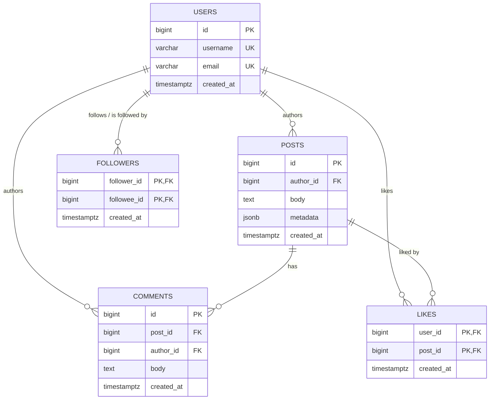

# Social Media Lab

A small social-media backend used to practice relational schema design,
transactions, caching, and query tuning: users can register, post, follow
each other, comment, and like posts, with a Redis-cached, per-follower
timeline backed by Postgres and an activity log written to MongoDB.

## Architecture

Clean-architecture layering, each layer depending only on the one below it:

```text
domain        pure dataclasses + Protocols — no I/O, no driver imports
  ↑
repositories  Postgres access (one table or query each), no business logic
  ↑
services      one transaction + side effects (activity log, cache) per use case
  ↑
cli           composition root — wires real Postgres/Redis/Mongo, dispatches commands
```

Services never touch `psycopg2`/`redis`/`pymongo` directly — they depend on
the `Protocol`s in `src/social/domain/interfaces.py`
(`UnitOfWork`, `Cache`, `ActivityLogger`, one per repository), and the CLI's
`App` class (`src/social/cli/__main__.py`) is the only place that wires the
real Postgres-backed implementations to them. Unit tests substitute fakes
for those same protocols instead.

## Schema

Five tables — `users`, `posts`, `comments`, `followers`, `likes`:



`followers` is a self-referencing many-to-many on `users` (`follower_id` and
`followee_id` both reference `users.id`), so it's drawn as a single
USERS↔FOLLOWERS relationship rather than two — see
[docs/er_diagram.md](docs/er_diagram.md) for why. Full column types, 3NF
justification, indexing rationale, and a real `EXPLAIN ANALYZE` before/after
for the feed-timeline query live in
[docs/schema_design.md](docs/schema_design.md). For how the application
code itself is structured and how a request flows through it end to end,
see [docs/how_it_works.md](docs/how_it_works.md).

## Project layout

```text
migrations/       001-006, applied in order by scripts/apply_migrations.py
queries/          standalone SQL for the queries analyzed in docs/
scripts/          apply_migrations.py — the migration runner
src/social/
  domain/         models.py (dataclasses), interfaces.py (Protocols)
  repositories/   one Postgres repository per table + the feed join query
  services/       one service per use case (transaction + activity log + cache)
  infrastructure/ Postgres pool/UnitOfWork, RedisCache, MongoActivityLogger
  cli/            __main__.py (composition root + argparse), interactive.py (REPL)
tests/
  unit/           fakes-based, no infrastructure required
  integration/    real Postgres, skipped automatically if unreachable
docs/             schema_design.md, er_diagram.md, how_it_works.md
main.py           `python main.py ...` without installing the package
```

## Setup

```bash
docker compose up -d              # Postgres, Redis, Mongo
python -m venv .venv
.venv/Scripts/activate             # .venv/bin/activate on macOS/Linux
pip install -e .
python scripts/apply_migrations.py
```

Copy `.env.example` to `.env` to point at anything other than the
docker-compose defaults — it's loaded automatically, no manual `export`
needed. `POSTGRES_HOST`, `POSTGRES_PORT`, `POSTGRES_DB`, `POSTGRES_USER`,
and `POSTGRES_PASSWORD` are read individually and assembled into a
connection string by `config.py`. Note the compose file maps
Postgres/Redis/Mongo to host ports 5433/6380/27018 rather than their usual
5432/6379/27017 — this sidesteps a common conflict where a locally
installed Postgres, Redis-compatible (e.g. Memurai), or Mongo service is
already bound to the standard port and silently intercepts the container's
traffic on `localhost`. pgAdmin (or any other Postgres client) can connect
directly to the container via `localhost:5433` — Docker doesn't hide the
data, it's a normal TCP connection like any other Postgres server.

## Running

`python main.py` with no arguments launches an interactive menu — no flags
to remember. It first asks you to log in (by username) or register; every
action after that runs as that logged-in user, so it never asks for your
own id. Anything else it needs (who to follow, which post to like or
comment on) is shown as a numbered list to pick from, not typed in as a
raw id:

```text
$ python main.py
Social Media Lab - interactive mode. Ctrl-D or 'q' to quit.

1) login
2) register
q) quit

> 2
username: alice
email: alice@example.com

Logged in as 'alice' (id=1).

1) create a post
2) follow a user
3) like a post
4) comment on a post
5) view my timeline
q) quit

> 2
Users you can follow:
  1) bob
pick a user (1-1): 1
```

Or drive it non-interactively, either via `python main.py <command> ...`
(no install needed) or the installed `social-cli` console script:

```bash
social-cli register alice alice@example.com
social-cli register bob bob@example.com
social-cli follow 1 2
social-cli post 2 "hello, world"
social-cli comment 1 1 "nice post"
social-cli like 1 1
social-cli timeline 1
```

## Tests

```bash
pytest tests/unit          # fakes only, no infrastructure required
pytest tests/integration   # requires `docker compose up -d` first; skips
                            # automatically if Postgres isn't reachable
```
