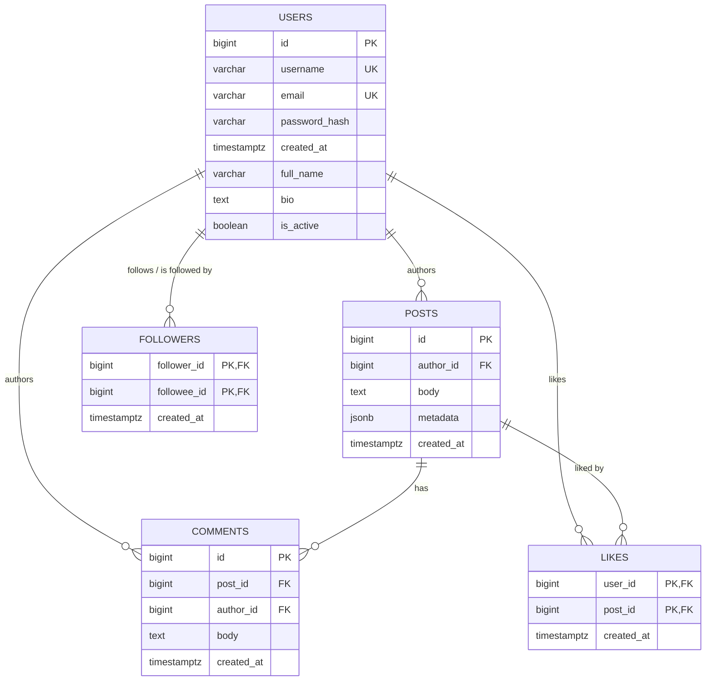

# Social Media Lab

A small social-media backend used to practice relational schema design,
transactions, caching, and query tuning: users can register, post, follow
each other, comment, and like posts, with a Redis-cached, per-follower
timeline backed by Postgres and an activity log written to MongoDB.

## Architecture

Clean-architecture layering, each layer depending only on the one below it:

```text
models, interfaces   dataclasses + Protocols — no I/O, no driver imports
  ↑
repositories          Postgres access (one table or query each), no business logic
  ↑
services              one transaction + side effects (activity log, cache) per use case
  ↑
composition + cli     composition root — wires real Postgres/Redis/Mongo, dispatches commands
```

Services never touch `psycopg2`/`redis`/`pymongo` directly — they depend on
the `Protocol`s in `src/social/interfaces/` (`UnitOfWork`, `Cache`,
`ActivityLogger`, one per repository), and the `App` class in
`src/social/composition.py` is the only place that wires the real
Postgres/Redis/Mongo-backed implementations to them. Unit tests substitute
fakes for those same protocols instead.

## Schema

Five tables, normalized to 3NF: no derived/cached columns (e.g. no stored
`like_count`), no repeating groups, and every non-key attribute depends on
nothing but its table's whole key — see
[docs/schema_design.md](docs/schema_design.md) for the full column-by-column
justification. This is the same DDL `src/social/database/schema.py` creates
automatically the first time the app connects (see [Setup](#setup)):



**Legend:** `PK` primary key · `FK` foreign key · `UK` unique constraint ·
`PK,FK` a column that is both at once — `followers` and `likes` are pure
associative tables whose composite primary key is built entirely from their
two foreign keys, which also doubles as the index that prevents a duplicate
edge.

`FOLLOWERS` is drawn as a single self-referencing edge on `USERS`, not two:
`follower_id` and `followee_id` are both `users.id`, so "follows" and "is
followed by" are the same edge viewed from either end, not two different
relationships. `LIKES`, by contrast, sits between two genuinely different
entities (a user, and the post they liked), so `USERS`↔`LIKES` and
`POSTS`↔`LIKES` are two distinct lines, not a duplicate of one relationship.
The full rationale, plus the constraints a diagram can't show
(`chk_followers_no_self_follow`, `ON DELETE CASCADE` on every foreign key),
live in [docs/er_diagram.md](docs/er_diagram.md). For how the application
code itself is structured and how a request flows through it end to end,
see [docs/how_it_works.md](docs/how_it_works.md).

## Project layout

```text
queries/          standalone SQL for the queries analyzed in docs/
scripts/          seed_data.py — optional demo-data loader
src/social/
  models/         one dataclass per file: User, Post, Comment, Follower, Like
  interfaces/     Protocols: repositories, Cache, ActivityLogger, UnitOfWork
  repositories/   one Postgres repository per table + the feed join query
  services/       one service per use case (transaction + activity log + cache)
  utils/          password_hashing.py, cache_keys.py — small, dependency-free helpers
  cache/          RedisCache (implements the Cache protocol)
  database/       Postgres pool/UnitOfWork, MongoActivityLogger, schema.py
  exceptions/     application-specific exception hierarchy
  composition.py  App — the composition root, wires infra to services
  cli/            __main__.py (argparse + main()), interactive.py (REPL)
tests/
  unit/           fakes-based, no infrastructure required
docs/             schema_design.md, er_diagram.md, how_it_works.md
main.py           `python main.py ...` without installing the package
```

## Setup

Postgres, Redis, and Mongo just need to be *reachable* somewhere — this
project doesn't care whether that's Docker, a locally installed service, or
anything else, and there's no migration step: `App` creates every table and
index it needs itself, the first time it connects (see
[Seed data](docs/how_it_works.md#seed-data) and
[The composition root](docs/how_it_works.md#the-composition-root-why-app-exists)
for how). `docker-compose.yml` is provided purely as a convenience for
getting all three running locally in one command; using it is optional.

```bash
docker compose up -d              # optional convenience: Postgres, Redis, Mongo in containers
python -m venv .venv
.venv/Scripts/activate             # .venv/bin/activate on macOS/Linux
pip install -e .
```

Copy `.env.example` to `.env` and point it at whatever Postgres/Redis/Mongo
you're actually running — it's loaded automatically, no manual `export`
needed. `POSTGRES_HOST`, `POSTGRES_PORT`, `POSTGRES_DB`, `POSTGRES_USER`,
and `POSTGRES_PASSWORD` are read individually and assembled into a
connection string by `config/settings.py`. If you do use
`docker-compose.yml`, note it maps Postgres/Redis/Mongo to host ports
5433/6380/27018 rather than their usual 5432/6379/27017 — this sidesteps a
common conflict where a locally installed Postgres, Redis-compatible (e.g.
Memurai), or Mongo service is already bound to the standard port and
silently intercepts the container's traffic on `localhost`. Either way,
whatever `.env` resolves to is exactly where the data goes — the app
doesn't check, or care, whether that's a container or a native install.

Once a store is reachable, `python main.py` (below) will create its own
schema on first connect. To load some demo data as well (4 users, follows,
posts, likes, comments — safe to re-run):

```bash
python scripts/seed_data.py
```

## Running

`python main.py` with no arguments launches an interactive menu — no flags
to remember. It first asks you to log in (by email and password) or
register; every action after that runs as that logged-in user, so it never
asks for your own id. Anything else it needs (who to follow, which post to
like or comment on) is shown as a numbered list to pick from, not typed in
as a raw id:

```text
$ python main.py
Social Media Lab - interactive mode. Ctrl-D or 'q' to quit.

1) login
2) register
q) quit

> 2
username: alice
email: alice@example.com
password:

Logged in as 'alice' (id=1).

1) create a post
2) follow a user
3) like a post
4) comment on a post
5) view my timeline
q) quit

> 2
Users you can follow:
  1) bob
pick a user (1-1): 1
```

Or drive it non-interactively, either via `python main.py <command> ...`
(no install needed) or the installed `social-cli` console script:

```bash
social-cli register alice alice@example.com hunter2
social-cli register bob bob@example.com hunter2
social-cli follow 1 2
social-cli post 2 "hello, world"
social-cli comment 1 1 "nice post"
social-cli like 1 1
social-cli timeline 1
```

## Tests

```bash
pytest tests/unit          # fakes only, no infrastructure required
```
