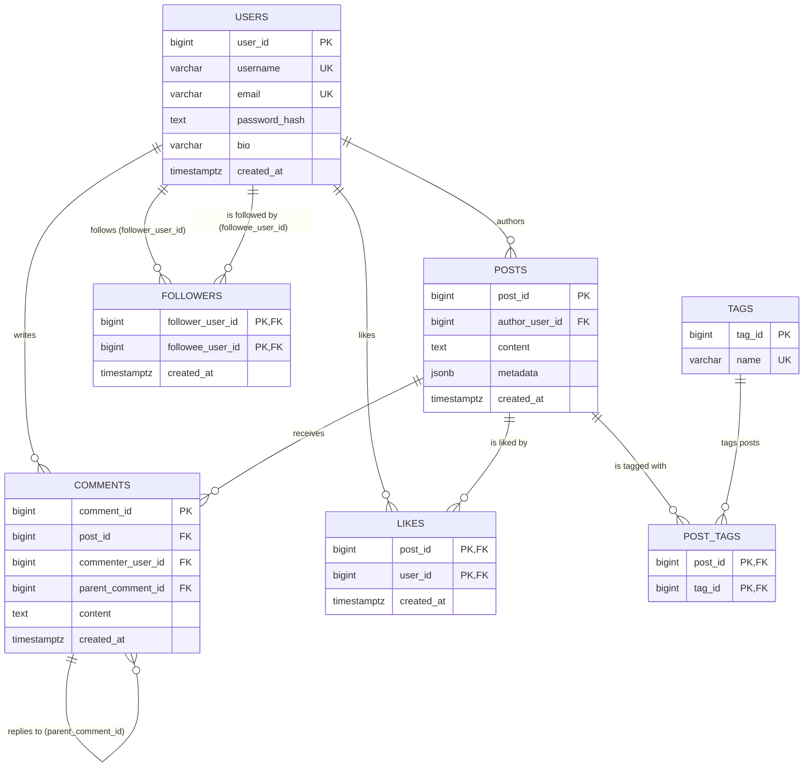

# Social Media Platform Data Backend

> The behind-the-scenes engine for a social media app — the part users never see, but that
> makes registering, posting, following, commenting, liking, and scrolling your feed all work
> correctly and quickly.

## What is this, in plain terms?

Every social media app — think Twitter/X, Instagram, or a class project like this one — needs
somewhere to durably store its data and rules for keeping that data correct and fast to read.
This project **is** that storage-and-rules layer. It doesn't have a visual interface; instead,
it's a command-line program that plays the role of the app's server, so it can be tested and
demonstrated without needing a website or mobile app in front of it.

It supports the core actions you'd expect from any social app:

| Action | What happens behind the scenes |
| --- | --- |
|   **Register / log in** | Your password is never stored in plain text — only a salted, scrambled ("hashed") version. Registration also takes an optional bio. |
|   **Create, edit, or delete a post** | Saved permanently with your name attached and a timestamp; editing or deleting only ever touches your own posts. |
|   **Follow / unfollow someone** | Recorded as an all-or-nothing operation — it either fully succeeds or fully fails, never half-happens. |
|   **Comment on a post, reply to a comment, or delete your own comment** | A reply is linked to its parent comment, forming a threaded sub-comment of arbitrary depth; deleting only ever touches your own comments. |
|   **Like or unlike a post** | Recorded permanently — liking/unliking the same post twice is a safe no-op, not a duplicate or an error. |
|   **View your feed** | A fast, paginated list of posts from everyone you follow, newest first. |
|   **View trending posts** | Posts ranked by how much recent discussion (comments) they're getting. |
|   **View a profile** | Your own or anyone else's — username, bio, and post/follower/following counts. |
|   **Search for users** | Find an account by (partial) username. |

Under the hood, it uses three specialized databases together, each doing the job it's best at:

- **PostgreSQL** — the permanent system of record for users, posts, tags, comments, follow
  relationships, and likes. If it's not in here, it didn't happen.
- **Redis** — a fast, temporary cache for feed pages, so re-loading your timeline doesn't hit
  the main database every single time.
- **MongoDB** — a flexible activity log that records "who did what, when" (follows, likes,
  posts, comments) for later analysis. It stores *only* that log — never the facts
  themselves, which always live in PostgreSQL.

## Tech stack

| Layer | Choice |
| --- | --- |
| Language | Python 3.11+, `src/` layout, packaged as `social-platform-backend` |
| Relational store | PostgreSQL 16 via `psycopg2-binary`, pooled with `psycopg2.pool.ThreadedConnectionPool` |
| Cache | Redis 7 via `redis-py` |
| Document store | MongoDB via `pymongo` |
| Config | `python-dotenv` — every setting has a safe default, nothing required to run locally |
| Testing | `pytest` + `pytest-cov`, `fakeredis` and `mongomock` for unit tests, real docker-compose services for integration tests |
| Static analysis | `mypy --strict`, `ruff`, `black` |

No web framework — this is a pure CLI/library backend with no HTTP layer, which keeps the
lab's focus on data modeling and query correctness rather than request handling.

## Try it yourself (no coding required)

Once it's [set up](#setup), the easiest way to explore the app is the interactive menu — just
run it and answer the prompts, the same way you'd use any text-based menu:

```bash
python main.py
```

```text
1. Login
2. Register
3. Exit
```

Register an account (with an optional bio) and log in to a short, seven-item top-level menu:

```text
1. Create a post
2. Browse your feed
3. Browse trending posts
4. Find people
5. My profile
6. Logout
7. Exit
```

Everything else lives one level down, reached by picking from a list rather than typing an
id: browsing your feed or trending posts opens a numbered list of *actual* posts, and opening
one shows exactly what you can do to it (comment, reply, like/unlike, and — if it's yours —
edit or delete); commenting shows the post's real comment thread, replies included, and lets
you reply to any comment in it, forming a threaded sub-comment; finding people searches real
usernames and opens the one you pick to follow/unfollow; My profile shows your own posts to
edit or delete, and your bio to update. No menu ever asks "enter a user id" or "enter a post
id" — it shows you what exists and lets you choose.

## Contents

- [What is this, in plain terms?](#what-is-this-in-plain-terms)
- [Tech stack](#tech-stack)
- [Try it yourself](#try-it-yourself-no-coding-required)
- [Setup](#setup)
- [Usage](#usage)
- [Project layout](#project-layout)
- [Data model](#data-model)
  - [Threaded comments](#threaded-comments)
- [Architecture](#architecture)
- [The transactional follow/unfollow contract](#the-transactional-followunfollow-contract)
- [Ownership enforcement](#ownership-enforcement)
- [Feed query performance](#feed-query-performance)
- [Account security](#account-security)
- [Error handling](#error-handling)
- [Scope decisions](#scope-decisions)
- [Testing, formatting, and type-checking](#testing-formatting-and-type-checking)
- [Interview prep: likely questions](#interview-prep-likely-questions)

## Setup

Docker runs the three databases only (PostgreSQL, Redis, MongoDB); the app itself is a
local Python process. You'll need [Python 3.11+](https://www.python.org/downloads/) and
[Docker](https://www.docker.com/products/docker-desktop/).

```bash
python -m venv .venv
.venv\Scripts\activate        # Windows
# source .venv/bin/activate   # macOS/Linux

pip install -r requirements.txt
pip install -e .

copy .env.example .env        # cp .env.example .env on macOS/Linux
docker compose up -d          # starts PostgreSQL, Redis, and MongoDB
```

`docker compose up -d` also creates all the database tables automatically the first time
it runs, using [`sql/schema.sql`](sql/schema.sql). If you ever need to (re)apply that
schema to an already-running database by hand:

```bash
psql -h localhost -p 5433 -U social_platform -d social_platform -f sql/schema.sql
```

> Postgres is published on host port **5433**, not the default 5432 — this avoids clashing
> with a locally installed PostgreSQL server, if you have one. The container's internal port
> is still 5432; only the host-side mapping changed, so nothing inside Docker needed to change.

Once setup is done, run `python main.py` and start exploring — see
[Try it yourself](#try-it-yourself-no-coding-required) above.

> Always add `-d` to `docker compose up`. Without it, your terminal attaches to the live log
> stream of every container — including MongoDB's healthcheck, which logs a connection every
> 5 seconds for as long as the container runs. `-d` runs everything in the background instead.

## Usage

Beyond the interactive menu, every action is also available as a direct, scriptable command —
useful for automation, testing, or demoing a single action without going through the menu.

```bash
# via the unified entry point
python main.py register-user <username> <email> <password> --bio "hello there"
python main.py create-post <author_user_id> "post content" --tag python --tag postgres --location Kigali
python main.py update-post <post_id> <author_user_id> "edited content" --location Remote
python main.py delete-post <post_id> <author_user_id>
python main.py follow-user <follower_user_id> <followee_user_id>
python main.py unfollow-user <follower_user_id> <followee_user_id>
python main.py add-comment <post_id> <commenter_user_id> "nice post"
python main.py add-comment <post_id> <commenter_user_id> "thanks!" --parent-comment-id <comment_id>
python main.py delete-comment <comment_id> <commenter_user_id>
python main.py like-post <actor_user_id> <post_id>
python main.py unlike-post <actor_user_id> <post_id>
python main.py get-user-feed <follower_user_id> --page 1
python main.py get-trending-posts --since-hours 24 --limit 10
python main.py get-user-profile <username>
python main.py update-bio <user_id> "new bio"          # omit the bio argument to clear it
python main.py search-users <query> --limit 10

python scripts/analyze_feed_query.py   # diagnostic only; no main.py subcommand
```

`follow-user`/`unfollow-user` and `like-post`/`unlike-post` are idempotent: running either
pair twice in a row is a no-op success (`Follow result: already_exists`, `Unfollow result:
did_not_exist`, "You already liked this post.", "You hadn't liked this post."), never an
error. `update-post`, `delete-post`, and `delete-comment` are ownership-scoped: they raise a
clean `OwnershipError`/`PostNotFoundError`/`CommentNotFoundError` if `author_user_id` /
`commenter_user_id` doesn't actually own the target — see [Ownership
enforcement](#ownership-enforcement). `add-comment --parent-comment-id` makes a comment a
reply to another comment on the *same* post; a parent id from a different post is rejected
with `InvalidCommentOperationError` — see [Threaded comments](#threaded-comments).

*For developers: every subcommand is defined in one place,
[`src/social_platform/cli/commands.py`](src/social_platform/cli/commands.py) — an argparse
subparser per action, each building only the services it needs from a shared
[`AppContext`](src/social_platform/cli/app_context.py) and reporting either success or a clean
domain error. `main.py` reads connection settings from the environment via
[`ApplicationSettings`](src/social_platform/common/settings.py) and dispatches to either
`commands.py` (any arguments) or the interactive menu (`cli/interactive.py`, no arguments).*

## Project layout

Code is organized **by feature, not by technical layer**: everything about posts — the
entity, the SQL, and the business logic — lives together in one folder, instead of being
spread across separate top-level `models/`, `repositories/`, and `services/` trees.

```text
Social_Media_Lab/                 # this project — one lab inside a larger training monorepo
├── docker-compose.yml            # PostgreSQL, Redis, and MongoDB only — the app runs locally
├── sql/schema.sql                # 3NF DDL: tables, constraints, indexes
├── docs/er_diagram.md            # Mermaid ER diagram
├── scripts/analyze_feed_query.py # EXPLAIN ANALYZE diagnostic for the feed query
├── src/social_platform/
│   ├── common/                   # cross-feature infrastructure, no feature depends on another
│   │   ├── settings.py           #   environment-driven configuration
│   │   ├── postgres_pool.py      #   pooled connections + the transactional cursor
│   │   ├── redis_client.py       #   Redis client factory
│   │   ├── mongo_client.py       #   MongoDB client factory
│   │   ├── security.py           #   password hashing + strength policy
│   │   ├── validation.py         #   username/email format checks
│   │   └── exceptions.py         #   the domain exception hierarchy
│   ├── features/
│   │   ├── users/                # model.py + repository.py (Protocol + Postgres impl) + service.py
│   │   ├── posts/                #   same shape: model, repository, service
│   │   ├── tags/                 #   repository only — the posts<->tags many-to-many
│   │   ├── comments/             #   same shape as users/posts
│   │   ├── followers/            #   same shape — the transactional follow/unfollow service
│   │   ├── likes/                #   model (LikeResult), repository, service — idempotent likes
│   │   ├── feed/                 #   model, repository (the CTE query), cache (Redis), service
│   │   ├── trending/             #   model, repository (the ranking query), service
│   │   ├── profile/              #   model (UserProfile) + service — composes 3 other features
│   │   └── activity_log/         #   model, repository (MongoDB) — logs only, no facts
│   └── cli/
│       ├── app_context.py        #   composition root: wires every concrete repository
│       ├── commands.py           #   scriptable subcommands (argparse)
│       └── interactive.py        #   the menu-driven session
└── tests/
    ├── unit/                     # mocked psycopg2 + fakeredis/mongomock + hand-written fakes
    └── integration/              # real docker-compose services, `pytest -m integration`
```

Each feature's `repository.py` defines a small `typing.Protocol` right above its concrete
`Postgres*`/`Redis*`/`Mongo*` implementation — e.g. `UserRepository` (the contract) and
`PostgresUserRepository` (the implementation) both live in
[`features/users/repository.py`](src/social_platform/features/users/repository.py). Services
depend on the Protocol, never the concrete class, which keeps Dependency Inversion without a
separate top-level `interfaces.py` file to jump to.

## Data model

Seven normalized (3NF) PostgreSQL tables carry every relationship — including likes and
tags, both of which are real many-to-many relationships rather than JSONB arrays or
Mongo-only facts:



`followers` and `likes` share the same idempotency pattern: a composite primary key
(`(follower_user_id, followee_user_id)` / `(post_id, user_id)`) doubles as both the
uniqueness constraint and the natural lookup index, so `INSERT ... ON CONFLICT DO
NOTHING` makes a repeat follow or a repeat like a safe no-op instead of a duplicate row
or a raised error. `idx_followers_followee_follower` / `idx_likes_user_id` cover each
table's reverse lookup direction.

### Threaded comments

`comments.parent_comment_id` is a nullable, self-referencing foreign key
(`ON DELETE CASCADE`): NULL means a top-level comment on a post, and a non-NULL value
means a reply to another comment on that *same* post — the classic adjacency-list model
for a tree stored in a normal relational table, no separate `replies` table needed.
Deleting a comment cascades to delete every reply beneath it, at any depth.

Reading a whole thread in display order —parent immediately followed by its replies,
before any later sibling — is a recursive CTE
([`PostgresCommentRepository.find_comment_thread_for_post`](src/social_platform/features/comments/repository.py)):
it starts from the post's top-level comments, walks one `parent_comment_id` hop per
recursive step, and builds a `bigint[]` sort path (`[3]`, `[3, 7]`, `[3, 7, 9]`, `[4]`, ...)
at each step so a plain `ORDER BY sort_path` yields correct depth-first order regardless of
how deep any one reply chain goes — the same "let array/tuple comparison do the sorting"
trick, applied to a tree instead of a flat list. `CommentService.create_comment` validates
that a reply's parent actually belongs to the post it's replying within *before* the insert
(`InvalidCommentOperationError` if not) — the foreign key alone can't express that
same-post constraint, so the service layer checks it explicitly, the same "service checks
first" discipline used for [ownership enforcement](#ownership-enforcement).

`tags` and `post_tags` form the many-to-many between posts and tags — a post can carry
several tags, a tag can apply to many posts — normalized as real rows specifically so
"which posts use this tag" is an ordinary indexed join (`idx_post_tags_tag_id`) instead
of scanning every post's JSONB metadata. Only `location` remains in `posts.metadata`
now, since it's a single free-form value with no cross-post relationship worth
normalizing.

`bio` is a nullable, at-most-280-character `VARCHAR` — a user's freeform "about me" text,
validated by `validate_bio` ([`common/validation.py`](src/social_platform/common/validation.py))
and settable at registration or later via `UserService.update_bio`. There is no separate
`profiles` table: a user's public profile (`UserProfile`,
[`features/profile/model.py`](src/social_platform/features/profile/model.py)) is composed on
read from `users.bio` plus a post count, follower count, and following count queried from
`posts` and `followers` — see [Architecture](#architecture).

All foreign keys cascade on delete. (Full diagram source: [`docs/er_diagram.md`](docs/er_diagram.md).)

## Architecture

Dependency direction is strictly inward, per feature: `cli` → `features/*/service.py` →
`features/*/repository.py` (a `Protocol`) ← its own `Postgres*`/`Redis*`/`Mongo*`
implementation → `common/`. A feature may depend on another feature's repository or model
(e.g. `likes` reads `posts`' `PostRepository` to check a post exists before liking it) but
never reaches into another feature's internals beyond its public `model.py`/`repository.py`.
`profile` is the extreme case of this: it owns no table and no repository of its own —
`ProfileService.get_profile`
([source](src/social_platform/features/profile/service.py)) takes `UserRepository`,
`PostRepository`, and `FollowerRepository` as constructor dependencies and composes one
`UserProfile` from all three on every read, rather than maintaining a denormalized
`profiles` table that could drift out of sync with the data it summarizes.

- **`common/`** — settings, pooled connections, password hashing, validation, and the
  exception hierarchy. Nothing feature-specific lives here, and nothing here imports from
  `features/`.
- **`features/*/model.py`** — the dataclass entities for that feature (`User`, `Post`,
  `Comment`, `FeedPostEntry`, `TrendingPostEntry`, `ActivityEvent`, the
  `FollowResult`/`UnfollowResult` outcome enums). No psycopg2/redis/pymongo import ever
  appears here.
- **`features/*/repository.py`** (and `feed/cache.py`) — a narrow `typing.Protocol` (the
  contract a service depends on) plus one concrete `Postgres*`/`Redis*`/`Mongo*`
  implementation. This is Dependency Inversion and Interface Segregation without a
  separate `interfaces.py` file: the contract and its one implementation sit side by side,
  in the same file, for the same feature.
- **`features/*/service.py`** — one class per use case, taking its repository dependencies
  through its constructor as `Protocol` types. No service ever imports psycopg2, redis, or
  pymongo directly.
- **`cli/app_context.py`** — the only module allowed to construct concrete repositories,
  wiring them into one `AppContext` from environment settings.
- **`cli/commands.py`** / **`cli/interactive.py`** — build services from the `AppContext`,
  run one use case, and translate domain exceptions into exit codes or clean error messages.
  Neither ever touches psycopg2/redis/pymongo directly.

## The transactional follow/unfollow contract

`FollowService.follow_user` / `unfollow_user`
([source](src/social_platform/features/followers/service.py)) is the feature this lab
grades most heavily, so its contract is explicit rather than left to convention:

1. **Self-follow is rejected up front** (`InvalidFollowOperationError`) before any SQL runs —
   a clean domain error instead of a parsed `CheckViolation`.
2. **The follow/unfollow edge write is one atomic PostgreSQL transaction**
   ([`PostgresFollowerRepository`](src/social_platform/features/followers/repository.py)):
   `INSERT ... ON CONFLICT (follower_user_id, followee_user_id) DO NOTHING` for follow,
   a plain `DELETE` for unfollow. `PostgresConnectionPool.cursor()`
   ([source](src/social_platform/common/postgres_pool.py)) commits on a clean exit
   and rolls back on any exception — the repository and service never touch a raw connection.
3. **Idempotent, not error-prone.** Re-following an already-followed user returns
   `FollowResult.ALREADY_EXISTS`; unfollowing a user not followed returns
   `UnfollowResult.DID_NOT_EXIST`. Neither raises.
4. **A nonexistent follower or followee** raises `UserNotFoundError` — the repository catches
   `psycopg2.errors.ForeignKeyViolation` and translates it; no raw psycopg2 exception type ever
   crosses the repository boundary.
5. **Pool exhaustion** raises `ConnectionPoolExhaustedError`, translated from
   `psycopg2.pool.PoolError` inside `PostgresConnectionPool.cursor()`.
6. **The MongoDB activity-log write happens only after the PostgreSQL transaction commits**, and
   is best-effort: a logging failure is caught and logged, never allowed to undo or fail an
   already-committed follow/unfollow. Cross-store two-phase commit is intentionally out of
   scope (see [Scope decisions](#scope-decisions)) — PostgreSQL is the single source of truth
   for the follow graph.

All five edge cases (self-follow, nonexistent user, duplicate follow, unfollow of a missing
edge, pool exhaustion) are covered against a **real** PostgreSQL instance in
[`tests/integration/test_transactional_follow.py`](tests/integration/test_transactional_follow.py)
and
[`tests/integration/test_postgres_connection_pool.py`](tests/integration/test_postgres_connection_pool.py) —
a mocked cursor would happily "succeed" on a self-follow insert that only a real `CHECK`
constraint rejects.

## Ownership enforcement

`update_post`, `delete_post` ([`features/posts/service.py`](src/social_platform/features/posts/service.py))
and `delete_comment` ([`features/comments/service.py`](src/social_platform/features/comments/service.py))
all follow the same two-layer pattern:

1. **The service checks ownership first**, for a clean, specific domain error: it looks the
   post/comment up by id, raises `PostNotFoundError`/`CommentNotFoundError` if it doesn't
   exist at all, then raises `OwnershipError` if it exists but belongs to someone else. This
   runs *before* any write, and is what a caller actually sees.
2. **The repository's write is separately scoped to the owner as defense in depth** — e.g.
   `PostgresPostRepository.update_post`
   ([source](src/social_platform/features/posts/repository.py)) runs `UPDATE posts SET ...
   WHERE post_id = %(post_id)s AND author_user_id = %(author_user_id)s`, so even a future
   caller that skips the service-layer check (a bug, not a supported path) still cannot
   mutate another user's row — the query itself is the last line of defense, the same
   "service checks first, the query itself backstops it" pattern used for the
   [follow/unfollow contract](#the-transactional-followunfollow-contract) above. A repository-level
   ownership miss can only report `PostNotFoundError`/`CommentNotFoundError` (zero rows
   matched), since the query has no way to distinguish "doesn't exist" from "exists but isn't
   yours" — that distinction is exactly what the service-layer check exists to provide.

`unlike_post` ([`features/likes/service.py`](src/social_platform/features/likes/service.py))
needs no ownership check at all: a like's primary key is `(post_id, user_id)`, so "delete my
own like" is inherently scoped by the caller's own user id, and removing a like that was
never there simply returns `UnlikeResult.DID_NOT_EXIST` rather than an error — the same
idempotent-by-primary-key pattern as `follow`/`unfollow`.

## Feed query performance

The timeline feed query
([`features/feed/repository.py`](src/social_platform/features/feed/repository.py))
uses two CTEs, a JOIN, and `ROW_NUMBER()` for pagination:

```sql
WITH followed_users AS (
    SELECT followee_user_id FROM followers WHERE follower_user_id = %(follower_user_id)s
),
timeline_posts AS (
    SELECT posts.*, ROW_NUMBER() OVER (ORDER BY posts.created_at DESC, posts.post_id DESC) AS row_number
    FROM posts JOIN followed_users ON followed_users.followee_user_id = posts.author_user_id
)
SELECT timeline_posts.*, users.username AS author_username
FROM timeline_posts JOIN users ON users.user_id = timeline_posts.author_user_id
WHERE timeline_posts.row_number BETWEEN %(first_row)s AND %(last_row)s
ORDER BY timeline_posts.row_number
```

Two indexes back it:

- `followers` primary key `(follower_user_id, followee_user_id)` — its leading column already
  serves the first CTE ("who does this user follow") without a dedicated index.
- `idx_followers_followee_follower (followee_user_id, follower_user_id)` — serves the reverse
  "who follows this user" direction.
- **`idx_posts_author_created_at (author_user_id, created_at DESC)`** — the index that actually
  accelerates the feed: it turns the join-then-sort into an index scan feeding `ROW_NUMBER()`,
  instead of a sequential scan over `posts` followed by an in-memory sort.

Run `python scripts/analyze_feed_query.py` to see `EXPLAIN ANALYZE` output for the feed query
with and without `idx_posts_author_created_at` (it drops the index, re-runs the plan, then
restores it). With the index present, the plan shows an index scan on
`idx_posts_author_created_at` feeding the window function directly; without it, the planner
falls back to a sequential scan on `posts` plus an explicit sort step — the difference the
composite index is there to eliminate.

## Account security

Passwords are never stored as typed. Registration and login both go through
[`common/security.py`](src/social_platform/common/security.py):

- **Hashing** (`hash_password` / `verify_password`) — each password is combined with a
  random, per-user salt and run through `scrypt`, a deliberately slow, memory-hard algorithm
  designed to resist brute-force guessing. Only the salt and the resulting hash are stored;
  the original password is discarded immediately. Verifying a login compares hashes using a
  constant-time comparison, so response timing can't leak information about how close a
  guess was.
- **Strength policy** (`validate_password_strength`) — a new password must be at least 8
  characters and include a lowercase letter, an uppercase letter, a digit, and a special
  character. Registration rejects anything weaker with a clear `WeakPasswordError` listing
  exactly what's missing, rather than a generic failure.
- **Confirm-on-entry, in the interactive menu.** Registration asks for the password twice
  and re-prompts both entries until they match
  ([`_prompt_password_with_confirmation`](src/social_platform/cli/interactive.py)) —
  a typo-catching UX check, not a domain rule, so it lives in the CLI layer rather than in
  `UserService.register`. The scriptable `register-user` command takes a single password
  argument with no confirmation step, since there's no "type it twice" in a one-shot command
  line.
- **Hidden terminal input for both login and registration.** The interactive menu reads
  every password field — login, the password prompt, and the confirmation prompt — through
  a separate `password_input_function` (`getpass.getpass` by default) rather than the
  ordinary `input_function` used for everything else, so typed characters never echo to the
  screen ([`run_interactive_session`](src/social_platform/cli/interactive.py)). `getpass`
  needs a real terminal; if none is attached (e.g. piped input in a test), it falls back to
  a visible prompt with a warning instead of crashing. The scriptable `register-user`
  command can't offer this — the password is already visible in the command you typed, or
  in your shell history, before the program ever runs.

## Error handling

| Exception | Raised when |
| --- | --- |
| `InvalidFollowOperationError` | A user attempts to follow or unfollow themselves. |
| `UserNotFoundError` | An operation references a user id that does not exist (foreign key violation). |
| `UserAlreadyExistsError` | Registration is attempted with a username or email already taken. |
| `WeakPasswordError` | A new password fails the strength policy above. |
| `PostNotFoundError` | An operation references a post id that does not exist. |
| `CommentNotFoundError` | An operation references a comment id that does not exist. |
| `OwnershipError` | A user attempts to edit/delete a post or comment they don't own. |
| `InvalidBioError` | A bio exceeds the maximum length (280 characters). |
| `ConnectionPoolExhaustedError` | No PostgreSQL connection is available from the pool. |

All defined in [`common/exceptions.py`](src/social_platform/common/exceptions.py).

Every CLI command catches `SocialPlatformError` (the root of this hierarchy), prints a clean
message to stderr, and exits with status 1 — no raw tracebacks or psycopg2 exception types ever
reach the terminal.

## Scope decisions

- **Trending posts uses PostgreSQL only** (posts ranked by recent comment count via a
  `GROUP BY` CTE), not a Postgres/MongoDB score merge. The lab's "complex queries" requirement
  is CTE+JOIN (feed) and `ROW_NUMBER()` (pagination) — both already demonstrated by the feed
  query — and MongoDB is already exercised independently by activity logging on every
  follow/post/comment/like action. A cross-store merge algorithm would add real risk for a
  lab graded on feed performance and transactional correctness, not trending.
- **MongoDB stores only the activity log, never the facts themselves.** Likes, follows,
  posts, and comments are all real PostgreSQL rows; MongoDB's `activity_logs` collection
  separately records that each of those events *happened* (who, what, when), purely for
  a write-heavy, schema-flexible audit trail. `LikeService.like_post`
  ([source](src/social_platform/features/likes/service.py)) is the clearest example: it
  writes the like to PostgreSQL's `likes` table first (the fact), then best-effort logs a
  `post_liked` event to Mongo (the log) — never the other way around, and never *only* to
  Mongo.
- **Likes use the same idempotency pattern as follows.** `PostgresLikeRepository.create_like`
  ([source](src/social_platform/features/likes/repository.py)) is `INSERT ... ON CONFLICT
  (post_id, user_id) DO NOTHING`, exactly like `PostgresFollowerRepository` — liking the same
  post twice returns `LikeResult.ALREADY_EXISTS` instead of a duplicate row or a raised error.
- **Tags are a normalized many-to-many, not a JSONB array.** `tags` and `post_tags`
  ([schema](sql/schema.sql)) exist specifically so "how many posts use this tag" and "which
  posts have this tag" are ordinary indexed joins rather than a scan of every post's JSONB
  metadata. `PostService.create_post` get-or-creates each tag by name and links it to the
  new post in one transaction ([source](src/social_platform/features/posts/service.py)).
  Only `location` remains as JSONB metadata now — a single free-form value with no
  cross-post relationship worth normalizing.
- **No cross-store two-phase commit.** The MongoDB activity-log write for
  follows/posts/comments/likes is best-effort and happens after the PostgreSQL transaction
  commits (see [above](#the-transactional-followunfollow-contract)). PostgreSQL is the
  single source of truth; a lost activity-log write is logged but never rolls back an
  already-committed action.
- **A user's profile is composed on read, not stored as its own table.** `ProfileService`
  ([source](src/social_platform/features/profile/service.py)) queries `users`, `posts`, and
  `followers` on every `get_profile` call instead of maintaining a denormalized `profiles`
  row that would need updating on every post/follow and could drift out of sync. Profile
  reads are far rarer than posts/follows are written, so the extra query cost at read time is
  the right trade-off over keeping a duplicate, eventually-stale summary in sync on every write.
- **Ownership is checked in the service layer, then re-enforced in the repository's WHERE
  clause.** `update_post`, `delete_post`, and `delete_comment` all look the target up first
  (for a specific `OwnershipError` vs. `PostNotFoundError`/`CommentNotFoundError`), then issue
  a write scoped to the same owner regardless — see [Ownership
  enforcement](#ownership-enforcement). This is defense in depth, not redundancy for its own
  sake: it's the same "service checks first, the query backstops it" discipline already used
  for self-follow rejection.
- **The Redis timeline cache uses a fixed TTL, not write-time invalidation.** Creating a post
  does not proactively invalidate every follower's cached feed page (that "fan-out on write"
  approach breaks down for high-follower-count accounts). Instead, cached pages simply expire
  after `TIMELINE_CACHE_TTL_SECONDS` (default 60s) — a deliberate "fan-out on read, short TTL"
  trade-off favoring high-read-workload performance.
- **Comment replies are a self-referencing adjacency list, not a separate `replies` table
  or a fixed-depth schema.** A `replies` table (or a `comments` table with `reply_to_1`,
  `reply_to_2`, ... columns) would cap nesting depth by design; `parent_comment_id` pointing
  back into `comments` supports a thread of any depth with one column, at the cost of needing
  a recursive query to read it back in order — see [Threaded comments](#threaded-comments).
- **The interactive menu is a short top-level menu that drills down, never a raw-id prompt.**
  Browsing a feed, a comment thread, or a user search all present a numbered list of what
  actually exists and let the actor pick from it, rather than asking them to already know
  (or go look up) a post/comment/user id. This trades a few extra list-then-pick round trips
  for an interface that matches how a real social app's UI works — you tap what you see, you
  don't type an id — and keeps the scriptable `commands.py` subcommands (still directly
  id-based, for automation and tests) entirely separate from that interactive experience.

## Testing, formatting, and type-checking

```bash
pytest                     # unit tests only (mocked/faked I/O, no live services needed)
pytest -m integration      # integration tests against the docker-compose stack (must be up)

black src tests scripts
ruff check src tests scripts
mypy src tests scripts
```

## Interview prep: likely questions

Short answers you can expand on live, each backed by a section above.

**"Why three different databases instead of just one?"**
Each store is doing the job it's actually good at, not spread thin for its own sake:
PostgreSQL is the single source of truth needing ACID transactions and foreign-key
integrity (users, posts, tags, comments, follows, likes); Redis is a disposable
read-through cache sitting in front of the one query that's read far more than it's
written (the feed); MongoDB is a schema-flexible, append-only event log recording that
each of those actions *happened* (who, what, when) — it never stores the fact itself,
only the log entry. See [Scope decisions](#scope-decisions).

**"How do you keep Postgres and MongoDB consistent when a follow also logs an activity event?"**
Deliberately, they aren't kept consistent via 2PC — Postgres is authoritative. The Mongo
write only happens *after* the Postgres transaction commits, and is best-effort: if it
fails, the failure is logged but the already-committed follow/unfollow is never rolled
back. See [The transactional follow/unfollow contract](#the-transactional-followunfollow-contract),
point 6.

**"How is `follow_user` made atomic, and what happens on a race (double-click follow twice)?"**
One `INSERT ... ON CONFLICT (follower_user_id, followee_user_id) DO NOTHING` inside a
single pooled connection's transaction — `cursor.rowcount` tells the service whether a
row was actually inserted, which becomes `FollowResult.CREATED` vs `ALREADY_EXISTS`.
Self-follows are rejected before any SQL runs *and* blocked at the DB layer by a `CHECK`
constraint (defense in depth — a test proves a mocked repository would let a self-follow
through, but the real constraint won't). See the [contract](#the-transactional-followunfollow-contract).

**"How does connection pooling work here?"**
`psycopg2.pool.ThreadedConnectionPool` wrapped in a context manager
(`PostgresConnectionPool.cursor()`) that checks a connection out, opens exactly one
transaction, commits on clean exit / rolls back on exception, then always returns the
connection to the pool — repositories never see a raw connection or call
`.commit()`/`.rollback()` themselves. Pool exhaustion is caught and translated into a
domain `ConnectionPoolExhaustedError` rather than leaking a raw `psycopg2.pool.PoolError`.
This is tested against a *real* pool sized to exactly one connection in
[`test_postgres_connection_pool.py`](tests/integration/test_postgres_connection_pool.py).

**"How is the feed query made fast, and how did you prove it?"**
Two CTEs (who I follow → their posts) plus `ROW_NUMBER()` for stable, offset-free
pagination, backed by a composite index `idx_posts_author_created_at (author_user_id,
created_at DESC)` that turns the plan into an index scan instead of a sequential scan
plus sort. Proven, not assumed: `scripts/analyze_feed_query.py` runs `EXPLAIN ANALYZE`
with the index, drops it, runs it again to show the fallback plan, then restores it.
See [Feed query performance](#feed-query-performance).

**"What's your testing strategy, and why not mock everything?"**
Unit tests mock/fake every I/O boundary (`MagicMock(spec=PostgresConnectionPool)`,
`fakeredis`, `mongomock`) and run by default with no services needed — fast feedback,
but they'd happily let a self-follow "succeed" against a mock. Integration tests
(`pytest -m integration`) run the exact same code against the real docker-compose stack
specifically to catch what a mock can't: real `CHECK`/foreign-key violations, real pool
exhaustion, real rollback-on-exception, real query correctness and pagination. See
[Testing, formatting, and type-checking](#testing-formatting-and-type-checking).

**"How are passwords handled?"**
Never stored or logged in plaintext. Each password is combined with a random per-user
salt and run through `scrypt` (deliberately slow and memory-hard to resist brute-force);
login verification uses a constant-time comparison so response timing can't leak how
close a guess was. A failed login and a nonexistent username return the identical error
— no user-enumeration side channel. See [Account security](#account-security).

**"Why organize code by feature instead of by technical layer (models/, repositories/, services/)?"**
Both keep the same SOLID guarantees — Dependency Inversion via a `Protocol` per repository,
one class per use case — but a layer-first layout means understanding "how following works"
requires jumping across three unrelated top-level folders. Grouping `followers/model.py`,
`repository.py`, and `service.py` together means one folder answers one question. The
trade-off is explicit: a feature occasionally imports another feature's repository (e.g.
`likes` reads `posts`' `PostRepository`) rather than staying fully isolated — acceptable
here since the features are genuinely related parts of one social graph, not independent
bounded contexts. See [Project layout](#project-layout).

**"Why doesn't a user have a display name — isn't that unusual for a social app?"**
Deliberately trimmed for this lab's scope: `username` is already the one human-readable,
unique identifier every other feature needs (it's what the feed and comments display,
`@username`-style), so a separate `display_name` was redundant surface area — one more
column, one more registration field, one more thing to keep in sync — without adding to
what the lab actually grades (schema design, transactional follow, feed performance). Real
products separate the two because a display name can change freely while a username often
can't; a from-scratch lab project doesn't need that distinction to demonstrate the same
database and transaction concepts.

**"Why confirm the password on registration, and why only in the interactive menu?"**
It's a data-entry safeguard, not a security control: typing a password blind (no visual
feedback) is error-prone, so the menu asks twice and re-prompts both entries on a mismatch
before anything is validated or hashed. It's UI-layer logic, not a domain rule — it lives in
`cli/interactive.py`, not `UserService.register`, so `UserService` still has exactly one
input contract (username, email, one already-confirmed password) regardless of which CLI
surface calls it. The scriptable `register-user <username> <email> <password>` command skips
it: a single command-line argument is already unambiguous, there's no "mistyped it and can't
see what I typed" scenario to guard against there.

**"How do you keep passwords from echoing to the terminal, and how do you test that?"**
`run_interactive_session` takes two separate input functions: `input_function` for
ordinary prompts, and `password_input_function` (defaulting to `getpass.getpass`) for
every password field — login, the new-password prompt, and the confirmation prompt. They're
threaded through as two distinct parameters specifically so tests can prove the *wiring* is
correct without needing a real terminal: a unit test supplies two different fake input
sources and asserts the password ones are drawn from the dedicated channel, not the general
one (`test_password_prompts_use_the_dedicated_hidden_input_channel`). Testing real terminal
echo-suppression itself would be testing Python's own `getpass` module, which is already
part of the standard library and doesn't need re-verifying here.

**"Why does `Profile` compose three repositories instead of having its own table?"**
Because a profile isn't a fact of its own — it's a *view* over facts that already live in
`users`, `posts`, and `followers`. Storing it separately (a `profiles` table with cached
post/follower/following counts) would mean updating that row on every post, follow, and
unfollow, and risking it drifting out of sync if any one of those updates is missed.
`ProfileService.get_profile` composes it fresh on every read instead — more expensive per
read, but reads are far less frequent than the writes that would otherwise need to keep it
in sync, and it can never be wrong. See
[Architecture](#architecture) and [Scope decisions](#scope-decisions).

**"Why check ownership in both the service and the repository — isn't that redundant?"**
They check different things at different points, not the same thing twice. The service
checks first so a caller gets a specific, useful error (`OwnershipError` — "this exists but
isn't yours" — vs. `PostNotFoundError` — "this doesn't exist at all"). The repository's
`UPDATE ... WHERE post_id = ... AND author_user_id = ...` is a structurally different
guarantee: even if some future code path skipped the service check entirely, the write
itself is physically incapable of touching another user's row. It's the same "service
checks first, the query is the last line of defense" pattern the follow/unfollow contract
already uses for self-follow rejection — proven the same way: a mocked repository would
happily let an unscoped `UPDATE` through, only a real `WHERE` clause against real data
proves it. See [Ownership enforcement](#ownership-enforcement).

**"Why are likes and tags relational tables instead of staying in MongoDB / a JSONB array?"**
Both were changed to demonstrate the same normalization principles the schema already uses
elsewhere, applied to data that's genuinely relational: a like is a fact connecting exactly
one user to exactly one post (a textbook many-to-many, same shape as `followers`), and a tag
applies to many posts while a post can carry many tags (another many-to-many, via the
`post_tags` join table). Keeping likes Mongo-only, or tags as a JSONB array, would work, but
neither supports an indexed join — "how many people liked this post" or "which posts use
this tag" would mean scanning documents/arrays instead of an ordinary `JOIN`. The bar for
"does this belong in MongoDB" became: is it a fact with its own identity and constraints
(→ PostgreSQL), or an unbounded, schema-flexible record that something else happened
(→ MongoDB)? Likes and tags are clearly the former. See
[Scope decisions](#scope-decisions) and [Data model](#data-model).

**"How do threaded replies work — why not a separate `replies` table?"**
`comments.parent_comment_id` is a nullable self-reference: NULL is a top-level comment,
non-NULL is a reply to another comment, at any depth — the standard adjacency-list way to
store a tree in one relational table, rather than capping nesting depth with a fixed set of
columns or duplicating the schema into a second `replies` table. The cost of that choice is
reading it back: a flat table has no built-in order, so
`PostgresCommentRepository.find_comment_thread_for_post` uses a recursive CTE that walks one
`parent_comment_id` hop per step and accumulates a `bigint[]` path (`[3]`, then `[3, 7]`,
then `[3, 7, 9]`) so a single `ORDER BY sort_path` produces correct depth-first order —
parent, then its replies, then the next sibling — no matter how deep any one thread goes.
See [Threaded comments](#threaded-comments).

**"Why does the interactive menu browse-and-pick instead of asking for an id, and why
doesn't that same redesign touch the scriptable commands?"**
Because the two surfaces serve different callers with different needs. A human at the menu
doesn't know a post's or a comment's internal id and shouldn't have to go find one — showing
them their feed, a comment thread, or a search's matches and letting them pick by number
matches how an actual social app works (you tap what's on screen). A script or a test, on
the other hand, already has the id it wants to act on — that's the whole point of automating
it — so making `commands.py` browse-and-pick too would only add friction with no benefit.
Keeping them as two independent CLI surfaces over the same services (`cli/interactive.py`
vs. `cli/commands.py`) means each stays optimized for its actual caller instead of
compromising to serve both. See [Try it yourself](#try-it-yourself-no-coding-required).
