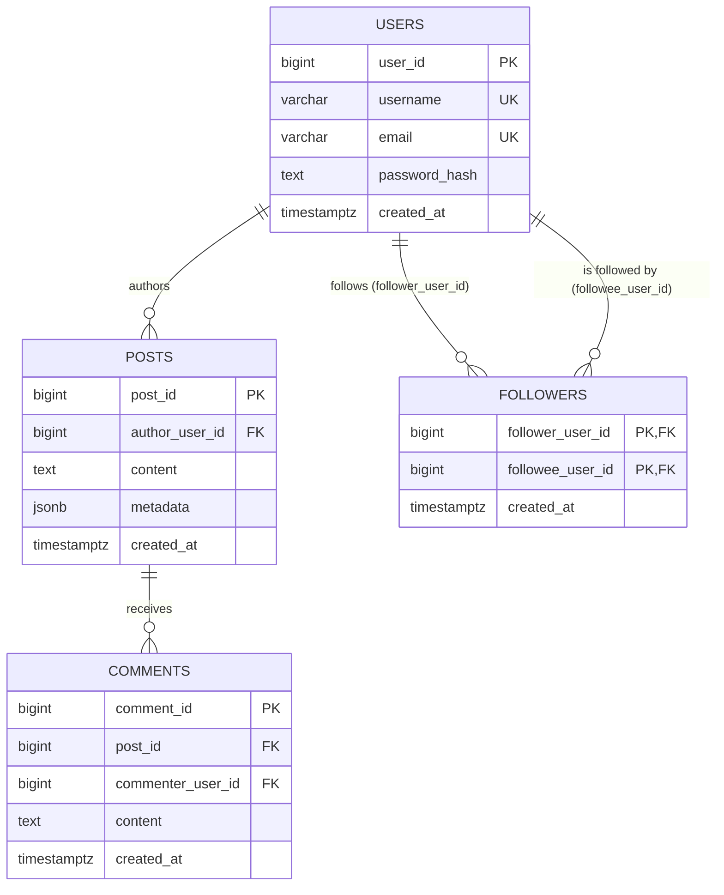

# Entity-Relationship Diagram

`followers` is a many-to-many self-relationship on `users`: each row means
`follower_user_id` follows `followee_user_id`. The composite primary key
`(follower_user_id, followee_user_id)` prevents duplicate follow edges and doubles as
a B-tree index for "who does this user follow"; `idx_followers_followee_follower`
covers the reverse "who follows this user" lookup.

Likes are intentionally **not** a relational table — per the lab's data-store split,
"like" activity lives only in MongoDB's activity log (see
`MongoActivityLogRepository`), not in PostgreSQL.
