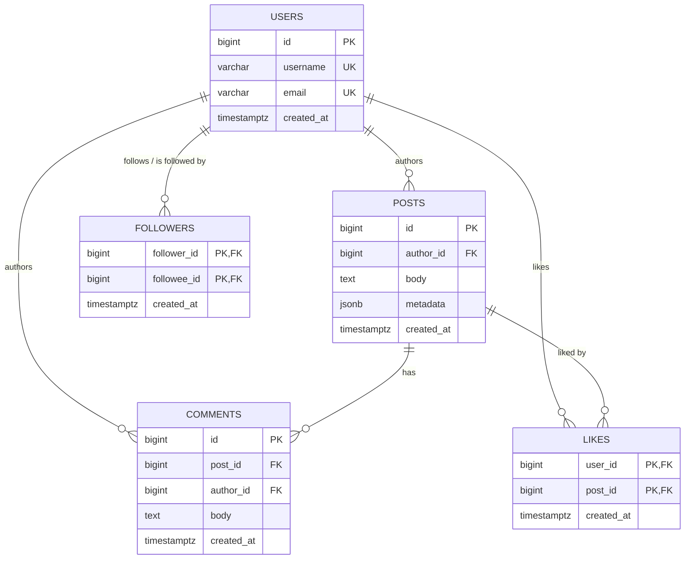

# Entity-Relationship Diagram

## Why `FOLLOWERS` is only one line, not two

`followers` is a self-referencing many-to-many relationship on `users`:
`follower_id` and `followee_id` both point at `users.id`. Drawing that as two
separate lines — "USERS follows FOLLOWERS" and "USERS is followed by
FOLLOWERS" — would just be the same USERS↔FOLLOWERS relationship repeated
twice with different labels; both roles are already fully captured by
`FOLLOWERS`' own two FK-marked attributes. So it's drawn once, labeled with
both roles.

`USERS`↔`LIKES` and `POSTS`↔`LIKES`, by contrast, are two genuinely
different relationships — `likes` is a junction table between two different
entities (a user, and the post they liked), not the same entity twice — so
both lines belong in the diagram.

## Notes

- `followers` and `likes` are pure associative tables: composite primary
  keys `(follower_id, followee_id)` and `(user_id, post_id)` both prevent
  duplicate edges and serve as their main lookup index.
- `chk_followers_no_self_follow` enforces that a user can't follow
  themselves — not representable in the diagram itself, only in the schema.
- Full column list, types, 3NF justification, and indexing rationale live in
  [schema_design.md](schema_design.md).
