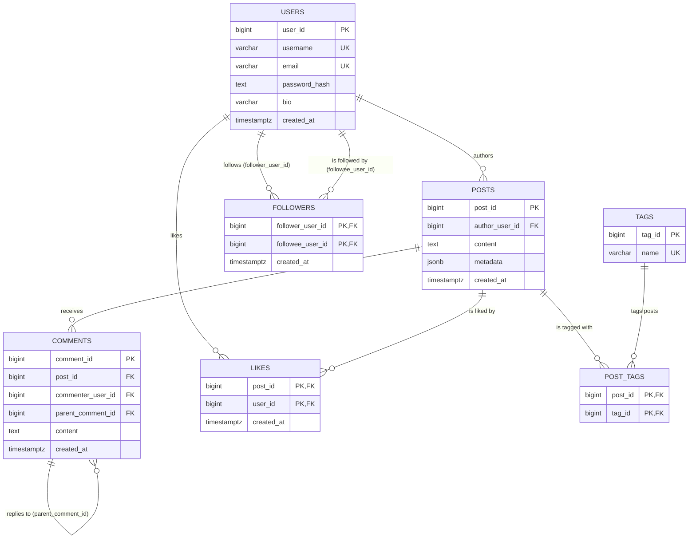

# Entity-Relationship Diagram

`followers` is a many-to-many self-relationship on `users`: each row means
`follower_user_id` follows `followee_user_id`. The composite primary key
`(follower_user_id, followee_user_id)` prevents duplicate follow edges and doubles as
a B-tree index for "who does this user follow"; `idx_followers_followee_follower`
covers the reverse "who follows this user" lookup.

`likes` is a real relational many-to-many between `users` and `posts`, using the same
idempotency pattern as `followers`: the composite primary key `(post_id, user_id)`
makes liking the same post twice a no-op (`INSERT ... ON CONFLICT DO NOTHING`) instead
of a duplicate row or a raised error. PostgreSQL is the source of truth for *whether* a
post is liked; MongoDB's activity log separately records that the like *event*
happened, exactly like every other action in this app — MongoDB never stores the fact
itself, only the log entry.

`comments` is a one-to-many self-relationship, the same shape as `followers` but on a
single column instead of two: `parent_comment_id` is a nullable foreign key back into
`comments` itself (`ON DELETE CASCADE`). NULL means a top-level comment on a post;
a non-NULL value means a reply to another comment on that *same* post, at any nesting
depth — the standard adjacency-list way to store a tree in one table, rather than a
separate `replies` table or a fixed number of `reply_to_N` columns that would cap how
deep a thread could go. `idx_comments_parent_comment_id` serves "which comments reply
to this one" — the one-hop-at-a-time lookup a recursive query walks to read a whole
thread back in depth-first order (parent, then its replies, then the next sibling); see
[`PostgresCommentRepository.find_comment_thread_for_post`](../src/social_platform/features/comments/repository.py).
Deleting a comment cascades to delete every reply beneath it.

`tags` and `post_tags` form the many-to-many between `posts` and `tags`: a post can
carry several tags, and a tag can be attached to many posts. `post_tags`' composite
primary key prevents attaching the same tag to a post twice and serves "which tags does
this post have"; `idx_post_tags_tag_id` serves the reverse "which posts use this tag"
direction. Tags are normalized rows here rather than a JSONB array specifically so both
of those questions are ordinary indexed joins, not a scan of every post's metadata. Only
`location` remains as post metadata JSONB now, since it's a single free-form value with
no cross-post relationship worth normalizing.

`users.bio` is a nullable, at-most-280-character `VARCHAR` — no separate `profiles` table
exists. A user's public profile is composed on read from three tables at once (`users.bio`
plus a post count from `posts` and follower/following counts from `followers`), not stored
or cached anywhere of its own; see the README's
[Architecture](../README.md#architecture) and [Scope decisions](../README.md#scope-decisions)
sections for why.

All foreign keys shown above cascade on delete (`ON DELETE CASCADE`) — deleting a user
deletes their posts, comments, follow edges, and likes; deleting a post deletes its
comments, likes, and tag links; deleting a comment deletes every reply beneath it.
