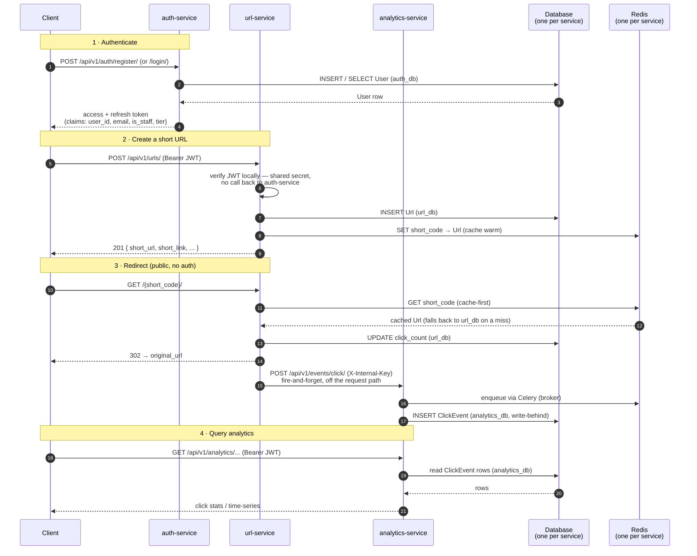

# Enterprise-Grade URL Shortener — Microservices


A URL shortener platform split into three independently deployable Django
REST Framework services, fronted by a single nginx API gateway. Each service
has its own database and its own Docker image (`Dockerfile` only — no
per-service `docker-compose.yml`); one `services/docker-compose.yml`
builds and runs all of them together, plus the gateway.

| Service               | Port   | Owns                                    | Responsibility                                                                          |
|-----------------------|--------|------------------------------------------|------------------------------------------------------------------------------------------|
| **gateway**            | `80`   | —                                        | Single front door: routing, centralized JWT verification (`auth_request`), CORS         |
| **auth-service**      | `8001`&#42; | `auth_db` (Users)                  | Register, log in, issue/refresh JWTs                                                    |
| **url-service**       | `8002`&#42; | `url_db` + Redis + Celery worker/beat | Create short URLs, resolve/redirect, report click events, nightly-archive expired URLs  |
| **analytics-service** | `8003`&#42; | `analytics_db` + Redis + Celery worker | Record click events (write-behind via Celery), serve click stats                    |
| **url-preview**       | `8004`&#42;&#42; | `url_preview_db` + Redis | Fetches title/description/favicon for a destination URL, resiliently (retry/backoff + per-domain circuit breaker) |

&#42; Each service's own host port is bound to `127.0.0.1` only, for local
debugging — real client traffic always goes through the gateway on `:80`.
See [API Gateway](#-api-gateway) below. &#42;&#42; url-preview additionally
has **no** client-facing route at all, not even through the gateway — it's
called only by url-service, internally, right after a URL is created; see
[`services/url-preview/README.md`](services/url-preview/README.md).

## 📑 Table of Contents

- [Architecture](#-architecture)
- [API Gateway](#-api-gateway)
- [Features](#-features)
- [Technology Stack](#️-technology-stack)
- [Prerequisites](#-prerequisites)
- [Setup Instructions](#-setup-instructions)
- [Authenticating Requests](#-authenticating-requests)
- [API Usage](#-api-usage)
- [Role-Based Access](#-role-based-access)
- [Testing](#-testing)
- [Database Schema](#️-database-schema)
- [Project Structure](#-project-structure)
- [API Endpoints](#-api-endpoints)
- [Troubleshooting](#-troubleshooting)
- [Development Notes](#-development-notes)
- [Performance Tuning](#-performance-tuning)
- [Production Deployment](#-production-deployment)

## 🧩 Architecture

Three independently deployable services, each with its own database — no
shared Users table — fronted by a single nginx gateway. One diagram, one
end-to-end request flow through the six main components: client, the three
services, and the database/cache each service keeps to itself. The gateway
itself is omitted from this particular diagram for clarity (see
[API Gateway](#-api-gateway) for its own request flow); every `C->>` call
below actually lands on the gateway first, which then proxies it to the
named service.



**Reading it**: `Database` and `Redis` each stand in for three (resp. two)
separate instances — every message names which one (`auth_db`, `url_db`,
`analytics_db`) — there is no shared database or cache anywhere in the
system. auth-service is only ever called once, at login — url-service and
analytics-service both verify the JWT's signature themselves and never call
back to it. The click-tracking call from url-service to analytics-service is
the one runtime hop between services, and it's fire-and-forget: it runs
after the 302 has already gone back to the client, so a slow or unreachable
analytics-service never delays a redirect.

## 🚪 API Gateway

A single nginx gateway (`gateway/`, plain `nginx:alpine`, no custom
`Dockerfile`) is the recommended front door for all client traffic — the
only place that verifies a JWT (via `auth_request`, calling auth-service's
internal token-validate endpoint once per request instead of each service
verifying it independently) and applies CORS for a browser frontend served
from a different origin.

| Path prefix                                            | Routed to    | Gated by `auth_request`? |
|----------------------------------------------------------|--------------|--------------------------|
| `/api/v1/auth/`                                           | auth-service | No — this is how you get a token |
| `/api/v1/docs/<service>/`, `/api/v1/schema/<service>/`    | that service | No                       |
| `/api/v1/urls/`                                           | url-service  | Yes                      |
| `/api/v1/analytics/`                                      | analytics-service | Yes                 |
| `/api/v1/internal/`, `/internal/`                         | —            | Blocked (404)            |
| `/health`                                                 | —            | No — nginx's own liveness check |
| `/api/v1/` (everything else), `/` (the short link itself) | url-service  | No                       |

Each service still also publishes its own host port (`8001`-`8003`), but
bound to `127.0.0.1` only and strictly for local debugging — hitting a
service directly like that bypasses the gateway's `auth_request`/CORS
entirely and must never carry real client traffic. Service-to-service calls
(url-service→analytics-service click reporting, analytics-service→url-service
ownership lookups) also deliberately skip the gateway — they authenticate
with a shared internal-token header instead of a user's JWT, so routing
them through the gateway would just be an extra hop.

Full detail — the `auth_request` flow, why `OPTIONS` preflights are
special-cased, the `envsubst` templating mechanism, configuration — lives in
[`gateway/README.md`](gateway/README.md).

## 🚀 Features

- **JWT Authentication** (auth-service): register/login with email + password; access & refresh tokens carry custom `email`, `is_staff`, and `tier` claims
- **Stateless cross-service auth**: url-service and analytics-service verify JWTs using a secret shared with auth-service — no network call back to auth-service, no local Users table, no coupling
- **Role-Based Access** (url-service): a URL's owner or a staff/admin user can update, delete, or list it — anyone else gets a 403, enforced from the token's `is_staff` claim alone
- **Tiered Permissions** (auth-service issues, url-service enforces): every user has a `tier` — Free, Premium, or Admin. Premium/Admin unlocks custom aliases; each tier gets its own daily rate limit
- **Rate Limiting**: register/login are throttled per-IP against brute-force; url-service's write endpoints are throttled per-user at a rate that scales with tier (Free: 100/day, Premium/Admin: 1000/day)
- **URL Shortening & Redirect** (url-service): short codes (or a Premium custom alias) backed by PostgreSQL, cached in Redis for fast lookups (cache-first, DB on a miss, invalidated on every update); supports tags, expiry, activation toggling, and per-link metadata
- **Click Analytics** (analytics-service): every redirect through url-service is reported as a click event and persisted write-behind by a Celery worker (never written inline in the request); owners can query per-link and per-account click stats
- **Nightly Cleanup** (url-service, Celery Beat): a scheduled job archives every URL past its `expires_at` (`is_archived=True`, deactivated, evicted from cache) once a day
- **Structured Logging**: every service logs JSON lines to both stdout and its own `logs/logs.json`, with 500-level errors (`django.request`) and security warnings (`django.security`, plus app-level warnings like a failed login attempt, a rejected internal-key, or an unauthorized write attempt) always captured
- **Health Checks**: `GET /health/` on every service verifies database connectivity (url-service and analytics-service also check Redis), returning 503 if anything's down
- **Database-per-service**: each service has its own Postgres container/database — no service can query another's tables
- **API Documentation**: each service serves its own interactive Swagger UI
- **API Gateway**: a single nginx gateway centralizes routing, JWT verification (`auth_request`), and CORS for all client traffic — see [API Gateway](#-api-gateway)
- **Docker Support**: every service has its own Dockerfile/image; one `services/docker-compose.yml` builds and runs all of them plus the gateway together — `docker compose up --build` from `services/`

## 🛠️ Technology Stack

- **Framework**: Django 5.0 + Django REST Framework, in all three services
- **Authentication**: JWT via `djangorestframework-simplejwt` (issued by auth-service, verified statelessly elsewhere)
- **Database**: PostgreSQL — a separate container per service
- **Cache**: Redis (`django-redis`), used by url-service for URL lookups
- **Background Tasks**: Celery, in url-service (nightly Celery Beat archive job) and analytics-service (write-behind click persistence) — each with its own Redis broker
- **Logging**: structured JSON to stdout and to `logs/logs.json` (each service has its own `logging_utils.JSONFormatter`)
- **API Documentation**: drf-spectacular (OpenAPI/Swagger) per service
- **Server**: Gunicorn (production)
- **Containerization**: Docker & Docker Compose

## 📋 Prerequisites

- Python 3.11+
- Docker & Docker Compose (for containerized setup, or to run Postgres/Redis locally)

## 🔧 Setup Instructions

There's no root-level `.env` — one `services/docker-compose.yml` is the
only thing that ties the services together, and each service under
`services/` still keeps its own `Dockerfile` and its own `.env`/`.env.example`
(secrets included); `gateway/` additionally keeps its own
`.env`/`.env.example` for the two values nginx's `envsubst` template needs
(see [API Gateway](#-api-gateway)).

`services/docker-compose.yml` only sets env vars Docker itself actually
needs: each Postgres container gets `env_file: ./<name>/.env` (relative to
`services/`, where the compose file itself lives) so Postgres reads its own
`POSTGRES_DB`/`POSTGRES_USER`/`POSTGRES_PASSWORD`
straight out of it; the extra Django-specific vars in that same file are
simply ignored by the `postgres` image). The app containers get **no**
`environment:`/`env_file:` block at all — each one's own `Dockerfile`
already `COPY`s that service's `.env` into the image, and Django reads it
directly at startup (`Config/settings.py`), so Docker doesn't need to pass
anything through separately. `POSTGRES_HOST`/`POSTGRES_PORT` (and, for
url-service, `REDIS_URL`/`ANALYTICS_SERVICE_URL`/`CELERY_BROKER_URL`; for
analytics-service, `CELERY_BROKER_URL`) are set in each `.env` to the
docker-network values directly (e.g. `POSTGRES_HOST=auth-db`), since these
services are meant to run in Docker — see the note on running a service
locally instead, in Option 2 below.

> Each service's app defaults to its own host port (`8001`/`8002`/`8003`,
> bound to `127.0.0.1` only) whether started via Docker or `manage.py
> runserver` — so don't run the same service both ways at once. Real client
> traffic should go through the gateway on `:80` instead of any of these
> directly (see [API Gateway](#-api-gateway)).

### Option 1: Run with Docker (Recommended)

1. **Copy each service's env file, plus the gateway's** (only needed once —
   real `.env` files are gitignored, so if they're already present you can
   skip this)
   ```bash
   cp services/auth-service/.env.example services/auth-service/.env
   cp services/url-service/.env.example services/url-service/.env
   cp services/analytics-service/.env.example services/analytics-service/.env
   cp gateway/.env.example gateway/.env
   ```
   `JWT_SECRET_KEY` must be identical across auth/url/analytics;
   `INTERNAL_API_KEY` must be identical between url-service and
   analytics-service; `INTERNAL_SERVICE_TOKEN` must be identical between
   auth-service and the gateway. The `.env.example` files already ship with
   matching placeholder values — change them together if you change them at
   all.

2. **Build and start the whole stack, from `services/`**
   ```bash
   cd services
   docker compose up --build
   ```
   This single command starts every service's own Postgres/Redis/Celery
   worker (plus Celery Beat, for url-service's nightly archive job), all
   three Django services, and the gateway. url-service still works fine if
   analytics-service isn't running yet — it just can't reach it to report
   clicks, and logs a warning each time instead of failing the redirect (see
   `clients/analytics_client.py`).
   `--build` matters here specifically because `.env` is baked into each
   app's image at build time — if you edit a service's `.env` after already
   building it once, run `docker compose up --build` again (not just `up`)
   so the new values actually take effect.

3. **Access the platform through the gateway**
   - Everything: http://localhost/ (short links, `/api/v1/...`)
   - Docs: http://localhost/api/v1/docs/auth/, `/api/v1/docs/shortener/`, `/api/v1/docs/analytics/`
   - Health check (gateway itself): http://localhost/health

   Or, for local debugging only (bypasses the gateway's auth/CORS — see
   [API Gateway](#-api-gateway)):
   - auth-service: http://localhost:8001/docs/
   - url-service: http://localhost:8002/docs/
   - analytics-service: http://localhost:8003/docs/
   - Django admin (per service): `:8001/admin/`, `:8002/admin/`, `:8003/admin/`
   - Health check (every service): `:8001/health/`, `:8002/health/`, `:8003/health/` — `200` if the database (and, for url-service/analytics-service, Redis) is reachable, `503` otherwise

### Option 2: Run a Service Locally (Without Docker)

Each service under `services/` is a self-contained Django project, using the
same `.env` file from Option 1 above — but that file's `POSTGRES_HOST`
(`auth-db`/`url-db`/`analytics-db`) and, for url-service, `REDIS_URL` /
`ANALYTICS_SERVICE_URL` / `CELERY_BROKER_URL` (and for analytics-service,
`CELERY_BROKER_URL`), are docker-network addresses, only resolvable from
inside Docker's network. Running `manage.py`/`celery` directly on your
machine instead, override them at the shell first (they take priority over
`.env` without editing it):

```bash
POSTGRES_HOST=localhost POSTGRES_PORT=5434 python manage.py runserver          # auth-service

# url-service
POSTGRES_HOST=localhost POSTGRES_PORT=5436 REDIS_URL=redis://127.0.0.1:6380/1 CELERY_BROKER_URL=redis://127.0.0.1:6380/2 python manage.py runserver
POSTGRES_HOST=localhost POSTGRES_PORT=5436 CELERY_BROKER_URL=redis://127.0.0.1:6380/2 celery -A Config worker -l info    # + separate terminal for Beat: celery -A Config beat -l info

# analytics-service
POSTGRES_HOST=localhost POSTGRES_PORT=5435 CELERY_BROKER_URL=redis://127.0.0.1:6381/0 python manage.py runserver
POSTGRES_HOST=localhost POSTGRES_PORT=5435 CELERY_BROKER_URL=redis://127.0.0.1:6381/0 celery -A Config worker -l info
```

Skipping the Celery worker still leaves the app itself fully usable — url-service's
nightly archive job just never runs, and analytics-service's `POST /api/v1/events/click/`
enqueues clicks that sit in Redis unprocessed until a worker is started.

1. **Create a virtual environment per service** (dependencies differ slightly
   per service, so don't share one venv across them)
   ```bash
   cd services/auth-service   # or url-service / analytics-service
   python -m venv venv
   venv\Scripts\activate  # Windows
   pip install -r requirements.txt
   ```

2. **Start just the infra containers you need**, from `services/` —
   `services/docker-compose.yml` covers this too, since each database/redis
   is its own compose service:
   ```bash
   cd services
   docker compose up -d auth-db
   docker compose up -d url-db url-redis
   docker compose up -d analytics-db analytics-redis
   ```
   Each db container is exposed on the host — `auth-db` on `5434`, `url-db` on
   `5436`, `analytics-db` on `5435` — and each service's own Redis is exposed
   too — url-service's on `6380`, analytics-service's on `6381` — matching the
   `POSTGRES_PORT`/`REDIS_URL`/`CELERY_BROKER_URL` already set in that
   service's `.env`.

3. **Run migrations and start the server on its own port**
   ```bash
   python manage.py migrate
   python manage.py createsuperuser   # optional, for that service's admin
   python manage.py runserver
   ```
   With no addrport argument, `runserver` normally falls back to `8000` for
   every service — `manage.py` here instead defaults it to that service's own
   `PORT` from `.env` (`8001`/`8002`/`8003`), so running all three locally at
   once doesn't collide. Pass an addrport explicitly (e.g. `runserver 9000`)
   to override it.

## 🔑 Authenticating Requests

Every protected endpoint expects the access token as a **Bearer token** on the
`Authorization` header — that's the one and only place it goes:

```text
Authorization: Bearer <your-access-token>
```

**In Swagger UI** (`:8001/docs/`, `:8002/docs/`, `:8003/docs/`):

1. Register or log in via auth-service's `/api/v1/auth/register/` or `/api/v1/auth/login/` and copy the `access` value from the response.
2. On whichever service's Swagger page you want to call, click the green **Authorize** button (top right), paste just the raw token — no `Bearer` prefix, Swagger adds that — and click **Authorize**.
3. Every "Try it out" call on that page now sends it automatically.

**Via curl / any HTTP client**, set the header directly:
```bash
curl -X POST http://localhost:8002/api/v1/urls/ \
  -H "Authorization: Bearer <your-access-token>" \
  -H "Content-Type: application/json" \
  -d '{"original_url": "https://example.com"}'
```

The token is only ever issued by auth-service, but url-service and
analytics-service both verify it themselves (see `security/authentication.py`
in url-service, `authentication.py` in analytics-service) and both show the
same Authorize button — this required manually registering
a `drf_spectacular.extensions.OpenApiAuthenticationExtension` for
`StatelessJWTAuthentication`, since drf-spectacular only auto-detects the
stock `JWTAuthentication` class, not a subclass of it.

## 📚 API Usage

### auth-service (`:8001`)

#### 1. Register — `POST /api/v1/auth/register/`
```json
{
  "email": "alice@example.com",
  "password": "StrongPassword123",
  "confirm_password": "StrongPassword123"
}
```
**Response** (201): `{ "id": 1, "email": "alice@example.com", "access": "...", "refresh": "..." }`

#### 2. Login — `POST /api/v1/auth/login/`
```json
{ "email": "alice@example.com", "password": "StrongPassword123" }
```
**Response** (200): same shape as register.

#### 3. Refresh — `POST /api/v1/auth/refresh/`
```json
{ "refresh": "<jwt-refresh-token>" }
```
**Response** (200): `{ "access": "<new-jwt-access-token>" }`

### url-service (`:8002`)

#### 4. Create Short URL — `POST /api/v1/urls/` (requires `Authorization: Bearer <access-token>`)
```json
{ "original_url": "https://www.example.com", "tags": ["news"] }
```
Free tier is capped at 10 **active** URLs (a 403 past that — deactivated ones
don't count); `custom_alias` requires Premium/Admin. `title`, `description`,
`favicon`, `is_active`, `expires_at`, and `tags` are all optional.
**Response** (201):
```json
{
  "id": 1,
  "original_url": "https://www.example.com",
  "short_url": "abc123",
  "short_link": "http://localhost:8002/abc123/",
  "custom_alias": null,
  "owner": "alice@example.com",
  "is_active": true,
  "expires_at": null,
  "title": null,
  "description": null,
  "favicon": null,
  "click_count": 0,
  "tags": ["news"],
  "created_at": "2026-08-31T14:00:00Z"
}
```

#### 5. List Your URLs — `GET /api/v1/urls/` (requires `Authorization: Bearer <access-token>`)
Returns only the URLs you own, paginated (`?page=`, `?page_size=`, 20/page by
default) and filterable by exact tag name (`?tag=news`). A staff/admin user
(see [Role-Based Access](#-role-based-access) below) gets every URL from
every owner instead.
**Response** (200): `{ "count": 1, "next": null, "previous": null, "results": [ <same shape as endpoint 4's response> ] }`

#### 6. Retrieve URL Details — `GET /api/v1/urls/{short_code}/` (or a `custom_alias`)

Public — no authentication required. Returns the same full shape as endpoint
4's response (not just the original URL). Returns 404 if the code is
unknown, inactive, or past its `expires_at`.

#### 7. Fully Update a Short URL — `PUT /api/v1/urls/{short_code}/` (requires `Authorization: Bearer <access-token>`)

```json
{ "original_url": "https://www.updated-example.com" }
```
`original_url` is required (a full update); `custom_alias`, `title`, etc. are
still optional. Only that URL's owner, or a staff/admin user, may do this —
anyone else gets a **403 Forbidden**.
**Response** (200): the updated URL, same shape as endpoint 4's response.

#### 8. Partially Update a Short URL — `PATCH /api/v1/urls/{short_code}/` (requires `Authorization: Bearer <access-token>`)

```json
{ "is_active": false }
```
Same ownership rule as PUT, but every field is optional — only what's
submitted gets changed (e.g. deactivating a link without touching anything
else).
**Response** (200): the updated URL, same shape as endpoint 4's response.

#### 9. Delete a Short URL — `DELETE /api/v1/urls/{short_code}/` (requires `Authorization: Bearer <access-token>`)
Only that URL's owner, or a staff/admin user, may do this — anyone else gets
a **403 Forbidden**. Hard-deletes the row and cascades to analytics-service,
removing that code's click history there too (fire-and-forget, in the
background — see [Role-Based Access](#-role-based-access)).
**Response** (204): empty body.

#### 10. Redirect — `GET /{short_code}/` (or a `custom_alias`)
Paste directly into a browser: http://localhost:8002/abc123/ → 302 to the
original URL. Returns 404 if inactive or expired. Every successful redirect
increments `click_count` and reports a click event (with best-effort
geolocation) to analytics-service — both happen in a background thread, so
they never delay the redirect itself.

### analytics-service (`:8003`, requires `Authorization: Bearer <access-token>`)

#### 11. Click Stats for One Short Code — `GET /api/v1/analytics/urls/{short_code}/`
**Response** (200): `{ "short_code": "abc123", "click_count": 4, "last_clicked_at": "2026-08-31T14:05:00Z" }`
Only counts clicks recorded under your own user id.

#### 12. Your Click Summary — `GET /api/v1/analytics/summary/`
**Response** (200): `[ { "short_code": "abc123", "click_count": 4 }, { "short_code": "xyz789", "click_count": 1 } ]`

#### 13. Detailed Analytics (Premium/Admin only) — `GET /api/v1/analytics/{short_code}/`

Daily time-series click counts plus a city/country geo breakdown. Free tier
gets a **403 Forbidden**. `city`/`country` are `null` for clicks whose IP
couldn't be geolocated (always true for private/local IPs, e.g. local dev).
**Response** (200):
```json
{
  "short_code": "abc123",
  "click_count": 4,
  "time_series": [ { "date": "2026-09-01", "count": 3 }, { "date": "2026-09-02", "count": 1 } ],
  "geo_breakdown": [ { "city": "Kigali", "country": "Rwanda", "count": 3 }, { "city": null, "country": null, "count": 1 } ]
}
```

#### 14. Record Click (internal) — `POST` / `DELETE /api/v1/events/click/`

Called by url-service, not meant for direct/public use — requires the
`X-Internal-Key` header to match `INTERNAL_API_KEY`. `POST` validates the
payload and hands the actual write off to a Celery worker
(`track_click_task.delay(...)`, write-behind — the view itself never writes
to the database) and returns 201 immediately; `DELETE` (body:
`{"short_codes": [...]}`) cascade-deletes click history for those codes,
called when url-service deletes a URL.

#### 15. Health Check — `GET /health/` (every service)

No authentication required. url-service and analytics-service verify both
database and Redis connectivity; auth-service (no cache/broker of its own)
checks just the database. Returns `{"status": "ok", "checks": {"database": true, "redis": true}}`
(200, `redis` omitted for auth-service), or `{"status": "unavailable", ...}`
with whichever check(s) failed set to `false` (503) otherwise.

## 🔐 Role-Based Access

Anyone can **read** a URL (`GET`, resolve, redirect) — but only its owner or
a staff/admin user can update (`PUT`/`PATCH`), delete, or see it in the
**list** endpoint. This is the classic `IsOwnerOrReadOnly` pattern (DRF's own
tutorial convention): public read, owner-or-admin write.

This is driven by an `is_staff` claim embedded in the JWT at register/login
time (`accounts/api/views.py` in auth-service, mirroring how the `email`
claim already works — see [Stateless JWT verification](#-development-notes)
below), read by url-service's `IsOwnerOrReadOnly` permission
(`url_shortener/api/permissions.py`) without any call back to auth-service.

To make a user an admin, set `is_staff=True` on their row in auth-service's
own Django admin (`http://localhost:8001/admin/`) or via
`python manage.py createsuperuser` — then have them log in again so the new
token carries the updated claim (existing tokens keep whatever `is_staff`
value they were issued with until they expire).

Deleting a URL you own (or any URL, as admin) hard-deletes it in `url_db`
**and** cascades to analytics-service, removing that code's click history
there too — both the delete and the cascade call run synchronously in the
request/response cycle except the actual HTTP call to analytics-service,
which fires from a background thread so a slow/unreachable analytics-service
never delays the 204 response.

### Tiered Permissions

Every user has a `tier`: `Free`, `Premium`, or `Admin` (default `Free` on
registration). Setting `tier` to `Admin` also grants `is_staff` automatically
(`accounts/models.py`'s `User.save()`); `is_premium` is likewise kept in sync
with `tier == "Premium"`. Change a user's tier the same way as `is_staff` —
via auth-service's Django admin — then have them log in again for a token
carrying the new claim.

What tier unlocks today:

- **`custom_alias`** on `POST`/`PUT`/`PATCH /api/v1/urls/`: Free tier gets a
  400 (`"Custom aliases are a Premium/Admin feature."`); Premium/Admin can
  set one, and it resolves identically to the generated `short_url`
  everywhere (`GET`, redirect, click reporting).
- **Active URL cap**: Free tier is capped at 10 **active** (`is_active=True`)
  URLs — the 11th `POST` gets a 403 until one is deactivated or deleted.
  Premium/Admin is unlimited. Deactivated URLs don't count against the cap.
- **Detailed Analytics** (`GET /api/v1/analytics/{short_code}/` on
  analytics-service): time-series + geo-location breakdown. Free tier gets a
  403 (`IsPremiumOrAdmin`); the basic stats/summary endpoints stay available
  to everyone regardless of tier.
- **Rate limits** (see below) scale with tier.

### Rate Limiting

- **auth-service**: `POST /api/v1/auth/login/` is throttled to **5 requests/minute
  per IP** (`LoginRateThrottle`, scope `login`) — brute-force protection on
  the one endpoint that's actually guessing a password. `POST /api/v1/auth/register/`
  gets a looser 20/minute (`AnonRateThrottle`, scope `anon`) against
  registration spam. Both throttle before any user/tier exists yet, so
  they're necessarily per-IP rather than per-user.
- **url-service**: write endpoints (`POST /api/v1/urls/`,
  `PUT`/`PATCH`/`DELETE /api/v1/urls/{short_code}/`) are throttled per user at a rate
  that scales with their tier claim — Free: 100/day, Premium/Admin: 1000/day
  (`TieredUserRateThrottle` in `url_shortener/api/throttling.py`). Exceeding
  it returns a **429 Too Many Requests**. Reads (list, resolve, redirect)
  aren't throttled.

## 🧪 Testing

Each service has its own test suite:
```bash
cd services/auth-service && python manage.py test
cd services/url-service && python manage.py test
cd services/analytics-service && python manage.py test
```

## 🗄️ Database Schema

Each model lives in the service that owns it — there are no cross-service
foreign keys, since each service has its own database (see
[Key Design Decisions](#-development-notes)). Where the schema conceptually
wants a foreign key to a row in another service's database, that reference
is stored as a plain denormalized id/value instead (`owner_id`/`owner_email`,
`short_code`).

### auth-service — `User` (`accounts/models.py`, extends `AbstractUser`)

| Field        | Type                                    | Notes                                             |
|--------------|-----------------------------------------|---------------------------------------------------|
| `email`      | `EmailField(unique=True)`               | Overrides `AbstractUser`'s non-unique default     |
| `is_premium` | `BooleanField(default=False)`           | Kept in sync with `tier == "Premium"` on save     |
| `tier`       | `CharField(choices=Free/Premium/Admin)` | Default `Free`; `Admin` also sets `is_staff=True` |

Plus everything `AbstractUser` already provides (`username`, `password`,
`is_staff`, `is_superuser`, `date_joined`, etc.).

### url-service — `Url` and `Tag` (`url_shortener/models.py`)

| Field                             | Type                                    | Notes                                                         |
|-----------------------------------|-----------------------------------------|---------------------------------------------------------------|
| `owner_id`                        | `PositiveIntegerField`                  | Denormalized reference to auth-service's `User.id` -- no FK   |
| `owner_email`                     | `EmailField`                            | Denormalized, same reason                                     |
| `original_url`                    | `URLField`                              | Must start with `http://` or `https://`                       |
| `short_url`                       | `CharField(unique=True, max_length=10)` | The generated 6-character code                                |
| `custom_alias`                    | `CharField(unique=True, null=True)`     | Premium/Admin-only; resolves identically to `short_url`       |
| `is_active`                       | `BooleanField(default=True)`            | `False` makes the link 404 on resolve/redirect (soft-delete)  |
| `expires_at`                      | `DateTimeField(null=True)`              | Past this timestamp, the link 404s on resolve/redirect        |
| `is_archived`                     | `BooleanField(default=False)`           | Set by the nightly `archive_expired_urls` Celery Beat task, not the owner |
| `archived_at`                     | `DateTimeField(null=True)`              | When the archive task swept this URL, if it has been          |
| `title`, `description`, `favicon` | `CharField(null=True)`                  | User-supplied metadata, not auto-fetched from the destination |
| `click_count`                     | `PositiveIntegerField(default=0)`       | Incremented atomically by url-service on every redirect       |
| `tags`                            | `ManyToManyField(Tag)`                  | Optional, set via the `tags` field on create/update           |
| `created_at`                      | `DateTimeField(auto_now_add=True)`      | --                                                            |

`Tag` is just `name` (`CharField(unique=True)`).

### analytics-service — `ClickEvent` (`analytics/models.py`)

| Field                    | Type                               | Notes                                                                                                                                |
|--------------------------|------------------------------------|--------------------------------------------------------------------------------------------------------------------------------------|
| `short_code`             | `CharField(max_length=50)`         | Denormalized reference to url-service's `Url` -- no FK; 50 chars to fit a `custom_alias`                                             |
| `owner_id`               | `PositiveIntegerField`             | Denormalized reference to auth-service's `User.id`                                                                                   |
| `referrer`, `user_agent` | `CharField`                        | From the redirecting request's headers                                                                                               |
| `ip_address`             | `GenericIPAddressField(null=True)` | --                                                                                                                                   |
| `city`, `country`        | `CharField(null=True)`             | Populated only if the reporting client supplies them (url-service doesn't do IP geolocation today, so these stay `null` in practice) |
| `clicked_at`             | `DateTimeField(auto_now_add=True)` | --                                                                                                                                   |

> **Caveat**: because `owner_id` is a denormalized integer rather than a
> real foreign key, resetting auth-service's database restarts its id
> sequence from 1 — any `owner_id` values already stored in url_db/analytics_db
> then risk colliding with a *different*, newly-registered user who happens
> to get the same recycled id. This is a known tradeoff of the
> database-per-service split; it isn't an issue in a system that's never had
> auth-service's database reset independently of the others.

## 📁 Project Structure

```
Enterprise-Grade_URL_Shortener/
├── gateway/                    # not a services/<name>/ Django app — no Dockerfile, just nginx:alpine + config
│   ├── nginx.conf              # routing, auth_request-based centralized JWT auth, CORS (envsubst template)
│   ├── .env.example            # INTERNAL_SERVICE_TOKEN, CORS_ALLOWED_ORIGIN
│   └── README.md               # full gateway design notes
├── services/
│   ├── docker-compose.yml      # the one orchestration file: every service + gateway
│   ├── auth-service/
│   │   ├── Config/                # settings (AUTH_USER_MODEL), urls, wsgi, asgi
│   │   ├── accounts/               # User(AbstractUser): email/is_premium/tier
│   │   │   ├── models.py          # User model, its own migrations
│   │   │   ├── admin.py           # UserAdmin exposing tier/is_premium
│   │   │   ├── health.py          # GET /health/ — database connectivity
│   │   │   ├── logging_utils.py   # JSONFormatter for structured stdout + logs/logs.json logging
│   │   │   ├── profiling.py       # ProfilingMiddleware (?profile=1) + @profile_function/@profile_lines decorators
│   │   │   └── api/               # register/login/refresh views (is_staff/tier JWT claims, failed-login warnings), serializers, urls
│   │   ├── gunicorn.conf.py        # workers/threads/timeouts/recycling — tunable via this service's .env
│   │   ├── Dockerfile              # this service's image (no docker-compose.yml here — see services/docker-compose.yml)
│   │   ├── requirements.txt, manage.py, .env.example
│   │   └── ...
│   ├── url-service/
│   │   ├── Config/                # settings, urls, wsgi, asgi, celery.py (Celery app + Beat schedule)
│   │   ├── url_shortener/
│   │   │   ├── models.py          # Url (owner_id/owner_email — no cross-service FK; custom_alias, tags, expiry, click_count, is_archived/archived_at), Tag
│   │   │   ├── caching.py         # cache_key/cache_url/invalidate_cache — shared by api/views.py and tasks.py
│   │   │   ├── tasks.py           # archive_expired_urls — nightly Celery Beat cleanup job
│   │   │   ├── health.py          # GET /health/ — database + Redis connectivity
│   │   │   ├── logging_utils.py   # JSONFormatter for structured stdout + logs/logs.json logging
│   │   │   ├── profiling.py       # ProfilingMiddleware (?profile=1) + @profile_function/@profile_lines decorators
│   │   │   ├── security/authentication.py  # StatelessJWTAuthentication (reads is_staff/tier claims) + its Swagger "Authorize" scheme
│   │   │   ├── clients/analytics_client.py  # fire-and-forget click reporting + ip-api.com geolocation + cascade-delete
│   │   │   └── api/               # views (short-code/alias gen, Redis cache, redirect+click_count, background threading), serializers, permissions (IsOwnerOrReadOnly), throttling (TieredUserRateThrottle), pagination (UrlPagination), urls
│   │   ├── gunicorn.conf.py        # workers/threads/timeouts/recycling — tunable via this service's .env
│   │   ├── Dockerfile              # no docker-compose.yml here — see services/docker-compose.yml
│   │   └── requirements.txt, manage.py, .env.example
│   └── analytics-service/
│       ├── Config/                # settings, urls, wsgi, asgi, celery.py (Celery app)
│       ├── analytics/
│       │   ├── models.py          # ClickEvent (city/country, short_code sized for a custom_alias)
│       │   ├── tasks.py           # track_click_task — write-behind ClickEvent persistence
│       │   ├── health.py          # GET /health/ — database + Redis connectivity
│       │   ├── logging_utils.py   # JSONFormatter for structured stdout + logs/logs.json logging
│       │   ├── profiling.py       # ProfilingMiddleware (?profile=1) + @profile_function/@profile_lines decorators
│       │   ├── authentication.py  # StatelessJWTAuthentication + its Swagger "Authorize" scheme
│       │   └── api/                # click-record/cascade-delete + stats + detailed-analytics views, permissions (IsInternalService, IsPremiumOrAdmin)
│       ├── gunicorn.conf.py        # workers/threads/timeouts/recycling — tunable via this service's .env
│       ├── Dockerfile              # no docker-compose.yml here — see services/docker-compose.yml
│       └── requirements.txt, manage.py, .env.example
│   └── url-preview/                # internal-only: no client-facing route, not even through the gateway
│       ├── config/                 # settings (lowercase "config", not "Config"), urls, wsgi, asgi, json_logging.py
│       ├── apps/preview/
│       │   ├── redis_client.py    # lazy singleton redis-py client (result cache + circuit breaker state)
│       │   └── api/
│       │       ├── views.py       # PreviewView — POST /api/v1/internal/preview/
│       │       ├── permissions.py # IsInternalService — X-Internal-Token
│       │       ├── health.py      # GET /health/ — database + Redis connectivity
│       │       └── services/      # preview_service.py (orchestrator + SSRF guard), fetcher.py, retry.py, circuit_breaker.py
│       ├── gunicorn.conf.py
│       ├── Dockerfile              # no docker-compose.yml here — see services/docker-compose.yml
│       └── requirements.txt, requirements-dev.txt, pytest.ini, manage.py, .env.example
└── README.md
```

There's deliberately no per-service `docker-compose.yml` or root-level
`Dockerfile`/`.env` — `services/docker-compose.yml` is the one place that
ties every service and the gateway together; each service otherwise stays
self-contained (its own `Dockerfile`, `.env`/`.env.example`) under its own
`services/<name>/` directory.

## 🎯 API Endpoints

| Service   | Method | Endpoint                               | Auth                                 | Description                                                 |
|-----------|--------|----------------------------------------|--------------------------------------|-------------------------------------------------------------|
| auth      | POST   | `/api/v1/auth/register/`               | No                                   | Register, returns JWT tokens                                |
| auth      | POST   | `/api/v1/auth/login/`                  | No                                   | Log in, returns JWT tokens (5/min throttle)                 |
| auth      | POST   | `/api/v1/auth/refresh/`                | No                                   | Exchange refresh token for new access token                 |
| url       | POST   | `/api/v1/urls/`                        | Yes                                  | Create a new short URL (Free: capped at 10 active)          |
| url       | GET    | `/api/v1/urls/`                        | Yes                                  | List your own URLs, paginated + ?tag= (all URLs for admins) |
| url       | GET    | `/api/v1/urls/{short_code}/`           | No                                   | Retrieve full URL details (public read)                     |
| url       | PUT    | `/api/v1/urls/{short_code}/`           | Owner or admin                       | Fully update a short code                                   |
| url       | PATCH  | `/api/v1/urls/{short_code}/`           | Owner or admin                       | Partially update a short code                               |
| url       | DELETE | `/api/v1/urls/{short_code}/`           | Owner or admin                       | Delete a short code, cascading to analytics                 |
| url       | GET    | `/{short_code}/`                       | No                                   | Redirect to the original URL; reports a click event         |
| analytics | GET    | `/api/v1/analytics/urls/{short_code}/` | Yes                                  | Click count + last click time for a code you own            |
| analytics | GET    | `/api/v1/analytics/summary/`           | Yes                                  | Click counts across all short codes you own                 |
| analytics | GET    | `/api/v1/analytics/{short_code}/`      | Premium/Admin                        | Time-series + geo-location breakdown                        |
| analytics | POST   | `/api/v1/events/click/`                | Internal key                         | Called by url-service only (write-behind via Celery)        |
| analytics | DELETE | `/api/v1/events/click/`                | Internal key                         | Cascade-delete click history (called by url-service)        |
| each      | GET    | `/api/schema/`, `/docs/`               | No                                   | OpenAPI schema / Swagger UI                                 |
| each      | GET    | `/admin/`                              | Session (that service's local admin) | Django admin                                                |
| each      | GET    | `/health/`                             | No                                   | Database connectivity check (+ Redis, for url/analytics)    |

## 🐛 Troubleshooting

### Port Already in Use
Every host port is set in `services/docker-compose.yml` (`80` for the
gateway, `8001`/`8002`/`8003` for the apps, `5434`/`5436`/`5435` for their
databases, `6380` for url-service's Redis, `6381` for analytics-service's
Redis) — change the left side of the `ports:` mapping for the service that
conflicts. Only the host-side number matters for this; services always talk
to each other over the internal Docker network on the container's standard
port regardless of how it's exposed to the host.

### 401s between services / tokens not verifying
`JWT_SECRET_KEY` must be **identical** across all three services' env, and
(if using the gateway) `INTERNAL_SERVICE_TOKEN` must match between
auth-service and `gateway/.env`. If you change either, restart the
affected containers (`docker compose up -d --build <service>` from the repo
root — env is only read at container start).

### Click events not showing up in analytics-service
url-service never blocks a redirect on analytics-service being reachable — it
logs a warning and moves on. Check url-service's logs for
`Failed to record click event`, and confirm `INTERNAL_API_KEY` matches between
url-service and analytics-service, and `ANALYTICS_SERVICE_URL` points at the
right host (`http://analytics:8000` — this service's name in the root
`docker-compose.yml`).

### Geo-location (city/country) always null in analytics

Two expected causes, not a bug:

1. **Local/private IPs never resolve.** `127.0.0.1`, `10.x`, `192.168.x`,
   etc. have no real-world location — `ip-api.com` correctly refuses to
   guess one. You'll only see real cities/countries when a click's
   `REMOTE_ADDR` is a genuine public IP (e.g. testing through a real deployed
   instance, not `localhost`).
2. **The lookup is best-effort and silent.** If `ip-api.com` is unreachable
   or rate-limits you, url-service logs a warning
   (`Geolocation lookup failed for ip=...`) and still reports the click with
   `city`/`country` as `null` — it never blocks or fails the click report
   over a geolocation failure.

### "Failed to redirect" / CORS error on `GET /{short_code}/`

This is expected, not a bug — and it **only** happens when the redirect is
followed by JavaScript's `fetch()` (exactly what Swagger UI's "Try it out"
does), never by a real browser tab. CORS restricts cross-origin `fetch()`/XHR
calls; it has no effect at all on a normal link click or address-bar
navigation. What actually happens: Swagger's `fetch()` follows the 302 and
then the **destination site** (whatever URL you shortened, e.g.
`example.com`) refuses the cross-origin `fetch`, which is entirely that
site's own CORS policy — url-service has no way to override a third party's
headers. The 302 response url-service sends is already correct (a clean
`Location:` header, nothing CORS-related blocking it). To see the real
behavior, open the short link directly — paste it into the browser's address
bar or click a real `<a>` link to it — never through Swagger's Execute
button.

### Migration Issues
```bash
cd services/<service-name>
python manage.py makemigrations
python manage.py migrate
```

## 📝 Development Notes

### How It Works
1. A user registers/logs in against **auth-service** and receives a JWT access + refresh token pair, with `user_id`, `email`, `is_staff`, and `tier` claims.
2. The user submits a long URL to **url-service** with `Authorization: Bearer <access-token>`. url-service verifies the token's signature itself (shared `JWT_SECRET_KEY`) and reads `user_id`/`email`/`is_staff`/`tier` straight from its claims — it never queries a Users table, because it doesn't have one.
3. url-service generates a unique short code (or validates a Premium/Admin-only `custom_alias`, and enforces the Free-tier 10-active-URL cap) and persists the `Url` row — owner, destination, alias, tags, expiry, etc. — in its own `url_db`, and caches the short_code/alias → URL/owner lookup in Redis (cache-first reads; a cache miss falls back to `url_db` and repopulates the cache; every update/delete evicts the cached entry).
4. Visiting `/{short_code}/` (or a `custom_alias`) on url-service resolves the URL (cache first, then `url_db`; 404 if inactive or past `expires_at`), atomically increments `click_count`, and redirects (302) immediately. A background thread then geolocates the IP (via a free public API) and POSTs a click event to **analytics-service** (`short_code`, `owner_id`, referrer, user-agent, IP, city, country) — entirely off the request/response path, so a slow/unreachable analytics-service or geolocation API never delays the redirect.
5. analytics-service verifies that call came from url-service via a shared `INTERNAL_API_KEY` header, validates the payload, and hands the actual write off to a Celery worker (`track_click_task.delay(...)`) — write-behind, so the view itself never blocks on a database write. Owners can query aggregate click stats for their own short codes; Premium/Admin owners can also pull a time-series + geo-location breakdown.
6. Updating, deleting, or listing a URL checks the same token's `is_staff` claim against that Url's `owner_id` — the owner or an admin may proceed, anyone else gets a 403 (reads stay public — see [Role-Based Access](#-role-based-access)); write requests are also throttled per the token's `tier` claim (see [Rate Limiting](#rate-limiting)). Deleting cascades to analytics-service's click history for that code, via the same kind of background thread as click reporting.
7. Once a day, url-service's Celery Beat scheduler fires `archive_expired_urls`: every `Url` past its `expires_at` gets `is_archived=True`, `is_active=False`, and is evicted from the cache.

### Key Design Decisions
- **Database-per-service**: `auth_db`, `url_db`, `analytics_db` are separate Postgres containers — no service can reach into another's tables. `Url.owner_id` / `ClickEvent.owner_id` are plain denormalized ids, not foreign keys, since the referenced User row lives in a different service's database entirely (see the [Database Schema](#️-database-schema) caveat about resetting auth-service's database independently of the others).
- **Stateless JWT verification**: url-service and analytics-service authenticate requests purely from the JWT's signature and claims (`url_shortener/security/authentication.py`, `analytics/authentication.py`) — no synchronous call back to auth-service on every request, and no duplicated Users table to keep in sync. Each service still keeps `django.contrib.auth` installed, but only for its own local admin-panel login, which is unrelated to this JWT-based API auth.
- **Background-thread cross-service calls, Celery for actual persistence**: the *cross-service* hop from url-service to analytics-service (click reporting + geolocation in `RedirectUrlView`, cascade-delete in `UrlDetailView.delete`) runs on a plain daemon `threading.Thread`, not Celery — it's a single fire-and-forget HTTP call, not a durable unit of work. Once that call lands, analytics-service's own database write is genuinely write-behind: `RecordClickView` validates the payload and hands it to `track_click_task.delay(...)`, a real Celery task backed by Redis, so a slow/unreachable database never blocks the response. url-service uses the same Celery/Redis infrastructure for a different purpose — `archive_expired_urls`, a Celery Beat job that runs once a day.
- **Free geolocation, no fabricated data**: `ip-api.com` (no API key) is queried for city/country on each click; it correctly can't resolve private/local IPs (e.g. `127.0.0.1` in local dev), so those fields stay `null` rather than showing made-up locations.
- **Role-based access via a JWT claim, not a lookup**: url-service enforces owner-or-admin checks (`url_shortener/api/permissions.py`'s `IsOwnerOrReadOnly`) purely from the `is_staff` claim already on the token — same stateless approach as authentication itself, no call back to auth-service to check a role.
- **Tiered rate limiting via the same claim approach**: `TieredUserRateThrottle` (`url_shortener/api/throttling.py`) picks a request quota from the token's `tier` claim alone, with no lookup either.
- **Structured JSON logging**: every service logs JSON lines to both stdout and its own `logs/logs.json` (each has its own `logging_utils.JSONFormatter`), with `django.request` (500s) and `django.security` (security warnings) always routed to both, plus app-level `logger.warning(...)` calls at points that matter for security monitoring — a failed login attempt (`accounts/api/views.py`), a rejected `X-Internal-Key` (`analytics/api/permissions.py`), an unauthorized write attempt on someone else's URL (`url_shortener/api/permissions.py`). `logs/` is gitignored on purpose (it's runtime output, not source) — each service's own `Config/settings.py` creates the directory on startup if it's missing, so a fresh checkout or Docker build never crashes for lacking it.
- **Health checks are real, not a static ping**: `GET /health/` on every service actually queries the database (`SELECT 1`); url-service and analytics-service also ping Redis. Returns 503 (not 200) the moment any check fails — suitable for a container orchestrator's liveness/readiness probe.
- **RESTful Design**: proper HTTP methods and status codes, one Swagger UI per service.

## ⚡ Performance Tuning

### Gunicorn

Every service has its own `gunicorn.conf.py` (next to `manage.py`), used by
both its `Dockerfile` and `services/docker-compose.yml`'s command for that
service (`gunicorn -c gunicorn.conf.py Config.wsgi:application`). It reads
its knobs from that service's own
`.env` directly — gunicorn parses this file itself, before it ever imports
`Config.wsgi`/`settings.py`, so `.env` is loaded here explicitly with
`django-environ` rather than relying on Django to have done it first. Every
knob below is optional; all have sensible defaults if left unset.

| Variable                       | Default             | Effect                                                                                    |
|---------------------------------|----------------------|--------------------------------------------------------------------------------------------|
| `GUNICORN_WORKERS`               | `(2 x CPU cores) + 1` | Worker process count — the standard starting point; pin it explicitly on a CPU-quota'd container rather than trusting the host's full core count |
| `GUNICORN_WORKER_CLASS`          | `gthread`            | `gthread` lets each worker serve several requests concurrently on threads — matters for url-service specifically, since a redirect spawns a background thread for click reporting |
| `GUNICORN_THREADS`               | `4`                  | Threads per worker (only used by `gthread`)                                               |
| `GUNICORN_TIMEOUT`               | `30`                 | Seconds before a silent worker is killed and restarted                                    |
| `GUNICORN_GRACEFUL_TIMEOUT`      | `30`                 | Seconds a worker gets to finish in-flight requests during a graceful restart              |
| `GUNICORN_KEEPALIVE`             | `5`                  | Seconds to hold a keep-alive connection open waiting for the next request                 |
| `GUNICORN_MAX_REQUESTS`          | `1000`               | Requests a worker handles before it's recycled — bounds slow memory growth                |
| `GUNICORN_MAX_REQUESTS_JITTER`   | `100`                | Random jitter on the above, so workers don't all recycle at the same instant              |
| `GUNICORN_PRELOAD_APP`           | `true`               | Loads the app once in the master before forking workers, sharing code pages between them; `gunicorn.conf.py`'s `post_fork` hook closes the inherited DB connection so each worker opens its own |
| `GUNICORN_LOG_LEVEL`             | `info`               | Gunicorn's own log level (separate from Django's `LOGGING`)                                |

`bind` itself is **not** configurable this way — it's hardcoded to
`0.0.0.0:8000` in every service's `gunicorn.conf.py`, since the root
`docker-compose.yml` maps each service's host port (`8001`/`8002`/`8003`) to
container port `8000`; that's a different thing from `PORT` in `.env`,
which only controls what `manage.py runserver` binds to locally, outside
Docker.

Gunicorn's own access log (`accesslog = "-"`, i.e. stdout) uses a format
that includes `%(D)s` — the request time in microseconds — so per-request
latency is visible in plain container logs without turning on profiling at
all.

### Profiling

Every service's `profiling.py` (`accounts/profiling.py`,
`url_shortener/profiling.py`, `analytics/profiling.py`) provides profiling
at two different granularities, both gated the same way — off unless
**both** are true:

1. `ENABLE_PROFILING=True` in that service's `.env` (`settings.PROFILING_ENABLED`)
2. Something explicitly asks for it (a request query param, or a decorator on the function itself)

#### Whole request: `ProfilingMiddleware`

Built on the standard library's `cProfile` — no extra dependency. Profiles
one request end-to-end when it carries `?profile=1`:

```bash
# Inline: top 30 stack frames by cumulative time, human-readable
curl "http://localhost:8002/api/v1/urls/?profile=1&format=text"

# File dump: full stats written to logs/profiles/, for offline inspection
curl "http://localhost:8002/api/v1/urls/?profile=1"
pip install snakeviz
snakeviz logs/profiles/api_v1_urls-<timestamp>.prof
```

Use this to see the whole call graph for one HTTP request, including
Django/DRF/middleware overhead outside your own code.

#### One function: `@profile_function` and `@profile_lines`

For measuring a *specific* function instead of a whole request — apply
either decorator directly to it:

- **`@profile_function`** — wraps it with `cProfile`, same as the
  middleware but scoped to just that function's own call graph.
- **`@profile_lines`** — wraps it with
  [`line_profiler`](https://github.com/pyutils/line_profiler) (a
  dependency in every service's `requirements.txt`), timing every
  individual *line* inside the function — the only way to see, e.g., that
  one specific line inside a function is 98% of its runtime, which
  `cProfile` alone can't tell you since it only measures at function
  granularity.

Both append a timestamped, human-readable entry to `logs/profiling.log`
every time the decorated function is called — no return-value change, no
per-call configuration:

```python
from url_shortener.profiling import profile_function, profile_lines

@profile_lines
def _resolve_short_code(short_code):
    ...

class RedirectUrlView(APIView):
    @profile_function
    def get(self, request, short_code):
        ...
```

A handful of hot-path functions already carry one or the other as a
working example: `LoginView.post` / `_tokens_for_user` (auth-service),
`RedirectUrlView.get` / `_resolve_short_code` (url-service), and
`DetailedAnalyticsView.get` / `UrlClickStatsView.get` (analytics-service).
Running that service's test suite with `ENABLE_PROFILING=true` is enough to
see real entries land in `logs/profiling.log` — e.g. `_tokens_for_user`'s
line profile shows JWT `str(access)` serialization as ~98% of that
function's time, and `LoginView.post`'s function profile shows
`pbkdf2_hmac` (password hashing) dominating the login request overall.

Both decorators are a no-op (a plain passthrough call, no profiler
attached) whenever `PROFILING_ENABLED` is off, so leaving them in the
codebase costs nothing in production.

`logs/profiles/` and `logs/profiling.log` both sit under the same
gitignored `logs/` directory as `logs.json` (see
[Structured Logging](#-development-notes)) — runtime output, not source,
created on demand.

**Never leave `ENABLE_PROFILING=True` on in a publicly reachable
production environment**: a profiled request or function call runs
measurably slower (every call, or every line, is intercepted), and letting
untrusted clients trigger one on demand is a cheap way to degrade the
service. Turn it on only where traffic is already trusted/internal, and
only for as long as you're actively investigating something.

## 🚢 Production Deployment

For production deployment:

1. Update each service's own `.env` with production values:
   - Set `DEBUG=False`
   - Generate strong, random values for `JWT_SECRET_KEY` and `SECRET_KEY` in every service, `INTERNAL_API_KEY` in url-service/analytics-service, and `INTERNAL_SERVICE_TOKEN` in auth-service + `gateway/.env` — keep each shared value identical across the services that share it
   - Configure `ALLOWED_HOSTS` per environment
   - Set `CORS_ALLOW_ALL_ORIGINS=False` and list real origins in `CORS_ALLOWED_ORIGINS` (each service's own CORS setting is a fallback for direct/debug access — the gateway's own `CORS_ALLOWED_ORIGIN` in `gateway/.env` is what actually governs normal client traffic; see [API Gateway](#-api-gateway))
   - Leave `ENABLE_PROFILING` unset (or `False`) unless you're actively debugging — see [Performance Tuning](#-performance-tuning)

2. All client traffic should go through the gateway (`gateway/`) — tune `GUNICORN_WORKERS`/`GUNICORN_THREADS`/etc. in each service's own `.env` for the target hardware, see [Performance Tuning](#-performance-tuning); don't expose each service's own host port (`8001`-`8003`) beyond `127.0.0.1`/local debugging

3. url-service and analytics-service each need their Celery worker running continuously (`celery -A Config worker -l info`) for click tracking / archiving to actually happen — `services/docker-compose.yml`'s `url-celery-worker`/`analytics-celery-worker` services cover this; url-service also needs `url-celery-beat` (`celery -A Config beat -l info`) for the nightly archive job to fire at all

4. Point your container orchestrator's liveness/readiness probes at each service's `GET /health/` — it fails (503) the moment that service's database (or, for url-service/analytics-service, Redis) is unreachable; the gateway's own `GET /health` only checks that nginx itself is up

5. Ensure the `auth_postgres_data`, `url_postgres_data`, `analytics_postgres_data`, `redis_data`, and `analytics_redis_data` volumes are backed up appropriately

## 📄 License

This project is created for educational purposes as part of the Python Backend course.

## 👨‍💻 Author

Created as Lab 1: URL Shortener Microservice — split into auth/url/analytics microservices.

---


